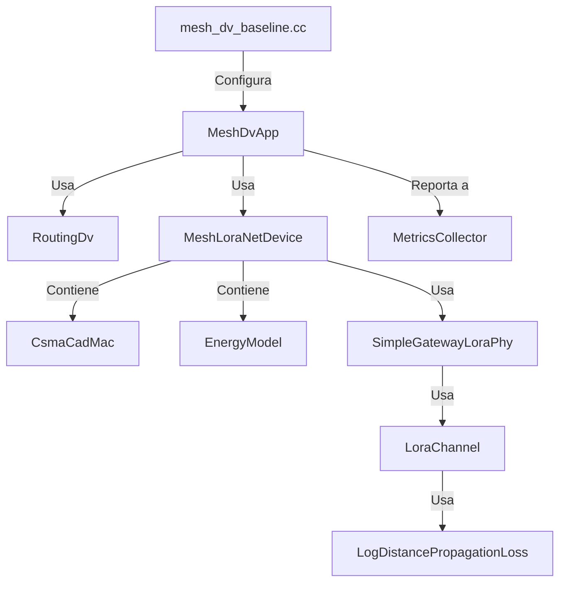
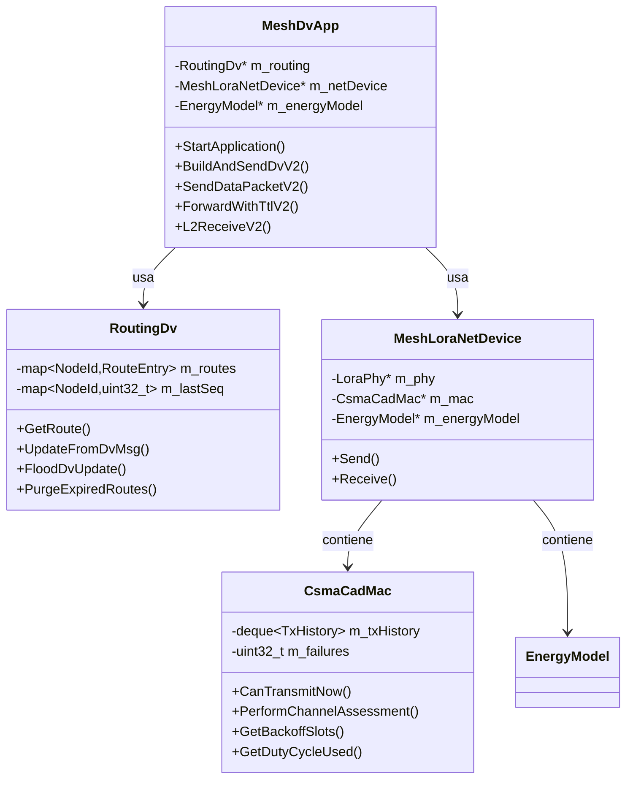
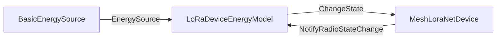
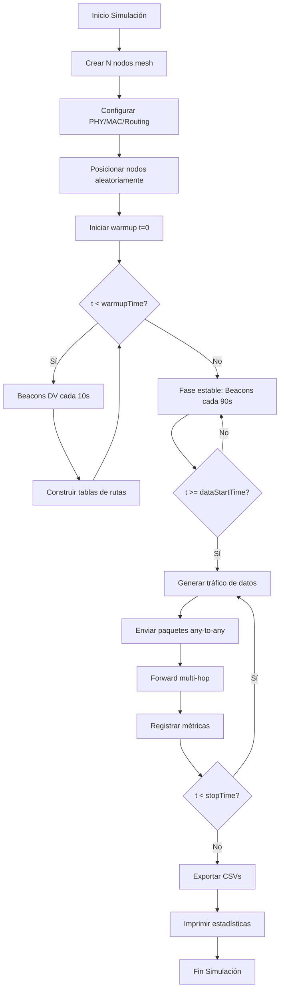
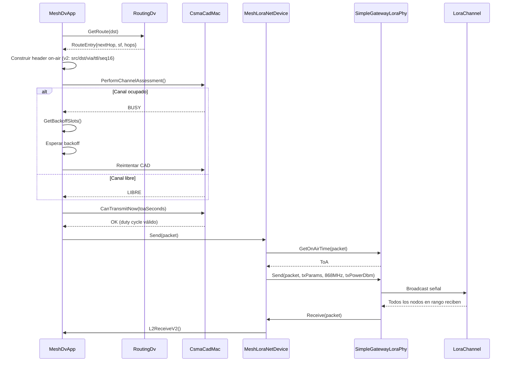
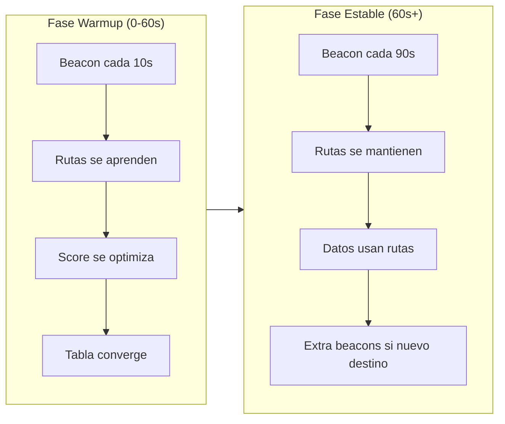

# Informe Técnico: Simulador de Red Mesh LoRa con Routing Distance-Vector

**Proyecto**: LoRaMESH-sim  
**Plataforma**: ns-3 (Network Simulator 3)  
**Entrega para**: Evaluación de Tesis  
**Fecha**: Febrero 2026

---

# PARTE I: FUNCTIONAL SPECIFICATION DOCUMENT (FSD)

## 1. Introducción

### 1.1 Objetivo del Sistema

El simulador LoRaMESH-sim tiene como objetivo principal **evaluar el rendimiento de una red mesh LoRa utilizando un protocolo de enrutamiento Distance-Vector (DV) proactivo**. El sistema permite simular comunicaciones any-to-any entre nodos mesh idénticos, sin depender de una arquitectura centralizada tipo LoRaWAN tradicional.

El simulador resuelve el problema de **estudiar el comportamiento de redes LoRa mesh a gran escala**, donde experimentación en hardware sería costosa y lenta, permitiendo:

- Evaluar métricas de rendimiento (PDR, latencia, throughput)
- Analizar convergencia del protocolo de routing
- Estudiar el impacto de parámetros LoRa (SF, potencia, duty cycle)
- Comparar estrategias de selección de rutas

### 1.2 Alcance

**Incluye:**

- Capa PHY LoRa (via módulo lorawan de ns-3)
- Capa MAC con CSMA/CAD y control de duty cycle (implementación propia)
- Protocolo de routing Distance-Vector proactivo (implementación propia)
- Modelo de energía por nodo
- Generación de tráfico any-to-any configurable
- Recolección y exportación de métricas a CSV y JSON estructurado
- Soporte multi-SF para beacons y datos **por enlace y en el tiempo** (single-demod: sin recepción concurrente en múltiples SF)

**Queda fuera:**

- Capa MAC LoRaWAN (no aplica a mesh)
- Network Server o Join Server
- Movilidad de nodos (topología estática)
- Canales múltiples (single-channel)
- Confirmación de paquetes (ARQ)

---

## 2. Descripción General de la Arquitectura

### 2.1 Componentes Principales

El simulador se organiza en las siguientes capas y módulos:

```
┌─────────────────────────────────────────────────────────────┐
│                    CAPA DE APLICACIÓN                        │
│  ┌─────────────────────────────────────────────────────────┐ │
│  │ MeshDvApp                                                │ │
│  │ - Generación de tráfico de datos                        │ │
│  │ - Manejo de beacons DV                                  │ │
│  │ - Forwarding de paquetes                                │ │
│  └─────────────────────────────────────────────────────────┘ │
├─────────────────────────────────────────────────────────────┤
│                    CAPA DE ROUTING                           │
│  ┌─────────────────────────────────────────────────────────┐ │
│  │ RoutingDv                                                │ │
│  │ - Tabla de rutas con métricas compuestas               │ │
│  │ - Procesamiento de mensajes DV                          │ │
│  │ - Selección de next-hop                                 │ │
│  └─────────────────────────────────────────────────────────┘ │
├─────────────────────────────────────────────────────────────┤
│                    CAPA MAC                                  │
│  ┌─────────────────────────────────────────────────────────┐ │
│  │ CsmaCadMac                                               │ │
│  │ - Channel Assessment vía CAD                            │ │
│  │ - Backoff adaptativo                                    │ │
│  │ - Control de duty cycle                                 │ │
│  └─────────────────────────────────────────────────────────┘ │
├─────────────────────────────────────────────────────────────┤
│                    CAPA DE RED/DISPOSITIVO                   │
│  ┌─────────────────────────────────────────────────────────┐ │
│  │ MeshLoraNetDevice                                        │ │
│  │ - Interfaz con PHY LoRa                                 │ │
│  │ - Encapsulación de paquetes                             │ │
│  │ - Filtrado de recepción                                 │ │
│  └─────────────────────────────────────────────────────────┘ │
├─────────────────────────────────────────────────────────────┤
│                    CAPA PHY (ns-3 lorawan)                   │
│  ┌─────────────────────────────────────────────────────────┐ │
│  │ SimpleGatewayLoraPhy                                     │ │
│  │ - Transmisión/recepción LoRa                            │ │
│  │ - Modelo de interferencia seleccionable                 │ │
│  │   (Puello fixed-capture o Goursaud probabilístico)      │ │
│  │ - Propagación Log-Distance                              │ │
│  └─────────────────────────────────────────────────────────┘ │
└─────────────────────────────────────────────────────────────┘
```

> Nota de modelado PHY: aunque se usa `SimpleGatewayLoraPhy`, en este simulador se configura con **1 sola reception path por nodo** (single-demod), por lo que **no** hay demodulación concurrente multi-SF.

### 2.2 Relaciones entre Componentes



---

## 3. Flujos de Uso Típicos

### 3.1 Inicialización del Sistema

1. El script `mesh_dv_baseline.cc` parsea parámetros de línea de comandos
2. Crea `N` nodos mesh idénticos (0 a N-1)
3. Configura el canal LoRa con modelo de propagación
4. Instala `MeshDvApp` en cada nodo con parámetros unificados
5. Cada `MeshDvApp` inicializa:
   - Su instancia de `RoutingDv` (tabla vacía)
   - Referencia a `MeshLoraNetDevice`
   - Lista de destinos de datos (todos los otros nodos)
6. Programa el primer beacon DV con jitter aleatorio por nodo
7. Inicia el simulador ns-3

### 3.2 Formación de Rutas (Convergencia DV)

```
t=0: Nodo 0 envía beacon DV (SF probabilístico)
     └── v2 on-air: [src=0, dst=0xFFFF, flags_ttl(type+rp_counter), entries=[]]
     └── `rp_counter` solo avanza en TX real (no en schedule)
     └── El receptor extiende `rp_counter` (mod-64) a secuencia monótona local por origen
     
t+ToA: Nodos vecinos reciben beacon
     └── Nodo 1 actualiza tabla: ruta a 0 via 0, hops=1
     └── Nodo 2 actualiza tabla: ruta a 0 via 0, hops=1
     
t+δ: Nodo 1 envía su beacon
     └── Contiene entradas DV compactas: [dst=0, score=X]
     
t+2δ: Nodo 3 (no alcanza a 0) recibe beacon de Nodo 1
     └── Actualiza tabla: ruta a 0 via 1, hops=2
     └── Actualiza tabla: ruta a 1 via 1, hops=1
```

Después de varios ciclos de beacons, todos los nodos tienen rutas a todos los demás destinos alcanzables.

### 3.3 Envío de Datos (Multi-hop)

```
t=90s: MeshDvApp en Nodo 5 genera paquete para Nodo 0
  1. Consulta RoutingDv.GetRoute(dst=0) → route{nextHop=3, hops=2, sf=*}
  2. Selecciona SF por salto local hacia nextHop:
     - `UseEmpiricalSfForData=true` + `EmpiricalSfSelectMode=robust_min`
     - usa el SF más bajo con evidencia reciente suficiente (ventana efectiva `linkFreshness`)
     - por defecto `linkFreshness` se auto-correlaciona al beacon activo (`NeighborLinkTimeoutFactor × beaconInterval`)
     - fallback conservador SF12 si no hay evidencia robusta
  3. Resuelve dirección de enlace de `nextHop`:
     - la asociación `nodeId -> linkAddr` se aprende dinámicamente en RX (principalmente desde beacons `v2`)
     - en `v2`, el NetDevice expone `from` como `Mac48` sintética determinista derivada de `BeaconWireHeaderV2.src` (`02:00:00:00:hi:lo`)
     - esa `Mac48` es solo wrapper interno de ns-3; la identidad on-air es la dirección de enlace lógica de 2 bytes (`src/via/dst`)
     - si existe entrada `nextHop -> linkAddr` reciente en caché: unicast normal
     - si la entrada existe pero su timestamp excede `LinkAddrCacheWindow` y `AllowStaleLinkAddrForUnicastData=true`: unicast permitido igual
     - **stale** significa antigüedad de la observación (`lastSeen`) de ese vecino, no cambio de identidad `nodeId/linkAddr`
     - si no existe entrada de caché para `nextHop`: `DATA_NOROUTE reason=no_link_addr_for_unicast`
  4. Construye paquete on-air `v2`:
     - `DataWireHeaderV2{src,dst,via,flags_ttl,seq16}` + payload app
     - `seq16` se usa para identificación E2E/deduplicación de datos, no como secuencia DV de control
  5. `CsmaCadMac.PerformChannelAssessment()` y luego TX unicast L2
  
t=90s+ToA: Nodo 3 recibe paquete
  1. MeshDvApp procesa como forward
  2. **No usa una ruta fija escrita en el paquete**: vuelve a consultar su propia DV local para dst=0
  3. Si `AvoidImmediateBacktrack=true` y nextHop nuevo == prevHop del paquete, descarta (`backtrack_drop`)
  4. Decrementa TTL, actualiza `via` (next-hop del nuevo salto) y selecciona SF local robusto
  5. Transmite
  
t=90s+2ToA: Nodo 0 recibe paquete (filtrado pasa: es destino final)
  1. MeshDvApp detecta myId == dst → DATA DELIVERED
  2. MetricsCollector registra entrega exitosa
```

**Trazabilidad de implementación (flujo E2E/SF local por salto):**
- `ns-3-dev/scratch/LoRaMESH-sim/mesh_dv_app.cc` (`SendDataToDestination`, `SendDataPacketV2`, `GetDataSfForNeighbor`, `ForwardWithTtlV2`, `L2ReceiveV2`)
- `ns-3-dev/src/loramesh/model/loramesh-routing-dv.cc` (`GetRoute`, `LookupNextHop`)

### 3.4 Re-routing (Cambio de Rutas)

El protocolo DV es **proactivo**: las rutas se actualizan con cada beacon recibido, no reactivamente.

1. Nodo A detecta nueva ruta mejor vía beacon
2. `RoutingDv::UpdateFromDvMsg()` arma candidato DV (poison o costo puro-compuesto)
3. Si candidato mejora costo y pasa histéresis de cambio de next-hop (`RouteSwitchMinDeltaX100`), actualiza la entrada
4. Próximo paquete de datos usa la nueva ruta automáticamente

### 3.5 Expiración de Rutas

1. `RoutingDv::GetRoute()` verifica `expiryTime` de la ruta
2. Si `Now() > expiryTime`, la ruta se marca expirada
3. `PurgeExpiredRoutes()` aplica ciclo `POISON` y luego `PURGE` en siguiente expiración
4. Si no hay ruta válida, paquete descartado con log `DATA_NOROUTE`

### 3.6 Finalización

1. `Simulator::Stop(Seconds(stopSec))` detiene la simulación
2. `MetricsCollector::ExportToCSV()` escribe archivos CSV:
   - `mesh_dv_metrics_tx.csv`
   - `mesh_dv_metrics_rx.csv`
   - `mesh_dv_metrics_routes.csv`
   - `mesh_dv_metrics_delay.csv`
   - `mesh_dv_metrics_energy.csv`
   - `mesh_dv_metrics_overhead.csv`
   - `mesh_dv_metrics_duty.csv`
   - `mesh_dv_metrics_routes_used.csv`
   - `mesh_dv_metrics_lifetime.csv`
3. `mesh_dv_baseline.cc` invoca `MetricsCollector::ExportToJson("mesh_dv_summary")` y genera `mesh_dv_summary.json` con estadísticas consolidadas
4. Se imprime resumen de estadísticas

---

## 4. Funcionalidades Principales

### 4.1 Gestión de Nodos y Topologías

| Funcionalidad | Descripción |
|---------------|-------------|
| Creación de nodos | `NodeContainer::Create(nEd)` crea exactamente N nodos idénticos (0 a N-1) |
| Posicionamiento | Random uniforme en área WxH o lineal con `spacing` |
| Parámetros por nodo | Todos comparten misma configuración (mesh plano) |
| Nodo colector/sink | Se fija como el último nodo (`nEd-1`) solo como referencia operativa (p. ej. `gwHeight` y trazabilidad); el tráfico de datos es any-to-any y cualquier nodo puede ser destino final |

**Modos de posicionamiento:**

- `random`: Posiciones aleatorias uniformes
- `line`: Distribución lineal con separación fija `spacing`

### 4.2 Configuración de Parámetros LoRa

| Parámetro | Rango | Default | Descripción |
|-----------|-------|---------|-------------|
| SF | 7-12 | Probabilístico | Spreading Factor |
| BW | 125/250/500 kHz | 125 kHz | Ancho de banda |
| TX Power | 2-20 dBm | 20 dBm (baseline) | Potencia de transmisión |
| Frequency | 868 MHz | 868 MHz | Frecuencia central |
| Coding Rate | 4/5-4/8 | 4/5 | Tasa de codificación |

**Sensibilidad usada por el stack mesh (SX1276, BW=125kHz):**

| SF | Sensibilidad |
|----|--------------|
| SF7 | -123 dBm |
| SF8 | -126 dBm |
| SF9 | -129 dBm |
| SF10 | -132 dBm |
| SF11 | -133 dBm |
| SF12 | -136 dBm |

**Modelo de Propagación FLoRa (Urban Environment):**

```
L(d) = L₀ + 10·n·log₁₀(d/d₀) + X_shadowing

Parámetros tesis:
├── n = 2.08 (path loss exponent)
├── d₀ = 40 m (distancia de referencia)
├── L₀ = 127.41 dB (pérdida a d₀)
└── σ = 3.57 dB (shadowing log-normal)
```

**Trazabilidad de implementación (bloque PHY/canal):**
- `ns-3-dev/scratch/LoRaMESH-sim/mesh_dv_baseline.cc` (`pathLossExponent`, `referenceDistance`, `referenceLossDb`)
- `ns-3-dev/src/loramesh/helper/loramesh-helper.cc` (`ConfigureChannel`: log-distance + shadowing σ=3.57)
- `ns-3-dev/src/lorawan/model/simple-gateway-lora-phy.cc` (sensibilidad SF7..SF12)

**Selección de SF:**

- Beacons: selección probabilística (p=0.5 para avanzar a SF mayor)
- Datos/forward: SF por salto local hacia `nextHop` con aprendizaje empírico robusto (`GetDataSfForNeighbor`)
- Modo por defecto: `EmpiricalSfSelectMode=robust_min`, `EmpiricalSfMinSamples=2`
- No se usa ADR por SNR/RSSI en el camino activo de envío de datos

### 4.3 Protocolo de Routing

#### 4.3.1 Descubrimiento de Rutas

- Beacons DV broadcast periódicos (cada 10s en warmup, cada 90s en fase estable)
- `wireFormat=v2` (default en baseline y en este documento): cada beacon anuncia rutas `DEST+SCORE` en 3 bytes por entrada (`DvEntryWireV2`)
- Rutas ordenadas por: destinos activos primero, luego mejor score

> Nota de coherencia de formato: en `v2` el payload DV es **score-only** (`destination`,`score`).
> Los campos `hops/sf/batt` anunciados no viajan como campos dedicados en beacon `v2`.
> En `wire=v2`, el único valor propagado en control-plane es `score`; variables como `battery(mV)` se registran solo como telemetría y para el cómputo local del score en el nodo que anuncia.

#### 4.3.2 Métrica Compuesta

```cpp
// Fórmula según tesis: C_ij = α·ToA_norm + β·Hop_norm + δ·Ψ(b)
const double alpha = 0.40;  // α: ToA (duty cycle efficiency)
const double beta = 0.30;   // β: Hop count (path length)
const double delta = 0.30;  // δ: Battery (network lifetime)

linkCost = alpha * toaNorm + beta * hopNorm + delta * batteryPenalty
// NOTA: RSSI/SNR NO se usa directamente (está embebido en selección de SF)
```

Factores considerados:

- **ToA normalizado (α=40%)**:
  - Definición: `ToA_norm = min(ToA_ij / ToA_max(SF_ij), 1.0)`
  - `ToA_max(SF)` se toma de una tabla de referencia interna (Semtech, BW=125kHz, CR=4/5) usada solo para normalización en `CompositeMetric`:
    - SF7: `143360 us`
    - SF8: `256512 us`
    - SF9: `462848 us`
    - SF10: `829440 us`
    - SF11: `1810432 us`
    - SF12: `3293184 us`
- **Hop count (β=30%)**:
  - Definición: `hopNorm = min(hops / h_max, 1.0)`
  - En la implementación actual de `CompositeMetric`, `h_max = 10` (constante de normalización de la métrica).
  - **No confundir** con `RoutingDv::m_maxHops` (default 12), que es un límite operativo de rutas/TTL y no la constante de normalización de `CompositeMetric`.
- **Battery penalty (δ=30%)**:
  - Definición actual: `Ψ(b) = 1 - b^2`
  - `b` es la fracción de energía remanente del nodo que anuncia el score (potencial relay): `b = E_rem / E_max`, con `b ∈ [0,1]`.
  - Interpretación: `Ψ(1)=0` (sin penalización), `Ψ(0)=1` (penalización máxima).

> En `v2` no se transporta `battery` explícita en beacon: el nodo anunciante internaliza su estado energético local dentro de `score`.
> Los vecinos consumen `score` como costo anunciado (`pathCost`) sin requerir campo SoC/batería separado on-air.

> **IMPORTANTE**: La calidad del enlace (SNR/RSSI) **NO** se usa como factor directo.
> Está implícitamente considerada porque un enlace malo requiere mayor SF → mayor ToA → mayor costo.

**Definiciones explícitas para evitar ambigüedad de notación (`C`, `linkCost`, `pathCost`):**

- `C_ij` (o `linkCost`): costo compuesto **local** del enlace `i -> j`, calculado con la fórmula anterior (`ToA_norm + hopNorm + Ψ(b)`).
- `pathCost`: costo **anunciado** por el vecino para `j -> destino`, reconstruido desde `entry.score` como `1 - scoreX100/100`.
- `combinedCost`: costo candidato en `RoutingDv` para `i -> destino vía j`, agregado como `max(linkCost, pathCost)` (modelo bottleneck, no suma aditiva).
- Conversión de escala usada en DV:
  - `scoreX100 = round(clamp(1 - cost_norm, 0, 1) * 100)`
  - `costX1000 = round(clamp(cost_norm, 0, 1) * 1000)`

#### 4.3.3 Actualización de Rutas (freshness por routing-packet counter)

Condiciones para aceptar nueva ruta:

1. Freshness nueva > freshness guardada (`msg.sequence` derivada de `rp_counter` on-air)
2. Menor costo interno (`costX1000`, 0..1000; menor es mejor)
3. Para mismo costo, menor SF
4. Mismo next-hop con freshness más nueva (refresh)
5. Si cambia `nextHop`, debe superar delta mínimo de score (`RouteSwitchMinDeltaX100`)
6. No está en hold-down

> En `v2`, la frescura DV usa `rp_counter` on-air (6 bits en `flags_ttl`) por emisor.
> El receptor extiende ese contador con regla robusta: `delta=(c-last) mod 64`, `delta==0` duplicado, `delta!=0` avance.

> Nota: `hops` sigue afectando la selección de rutas a través del costo compuesto
> (componente β), pero ya no se usa como desempate explícito cuando `costX1000` empata.

> Aclaración de `v2`: el beacon transporta `rp_counter` on-air (6 bits), usado como **routing-packet counter**
> para ordering/frescura de control-plane; no se modela como “DV sequence number clásico” tipo DSDV/AODV.
> En recepción, cada nodo lo expande localmente (wrap mod-64) para obtener `msg.sequence` monótono;
> si `delta>32`, se contabiliza `rp_gap_large_events` (telemetría), pero no se descarta la actualización.
> antes de pasar el mensaje a `RoutingDv`.

Regla de poison:

- Si una entrada DV llega con `score=0`, se mantiene como inalcanzable (no se recombina a score positivo).

Definiciones operativas en DV:

- `linkCost`: costo compuesto local del enlace `nodo_actual -> vecino` (derivado de `linkScore`).
- `pathCost`: costo compuesto anunciado por el vecino para `vecino -> destino` (derivado de `entry.score`).
- `combinedCost`: agregación de ruta actual en `RoutingDv`, definida como `max(linkCost, pathCost)` (modelo bottleneck: domina el tramo más débil).
- Conversión de escala: `scoreX100 = round((1 - cost_norm) * 100)`, `costX1000 = round((1 - scoreX100/100) * 1000)`.

#### 4.3.4 Expiración de Rutas

- `routeTimeout`: calculado dinámicamente como `beaconIntervalActivo × routeTimeoutFactor`
  - ejemplo: `beaconStable=60s`, `routeTimeoutFactor=6` ⇒ `360s`
  - ejemplo: `beaconStable=30s`, `routeTimeoutFactor=6` ⇒ `180s`
- `linkFreshness` (ventana SF empírica por vecino):
  - modo por defecto auto: `NeighborLinkTimeoutFactor × beaconIntervalActivo` (factor default = `1.0`)
  - modo manual: `NeighborLinkTimeout` fijo, solo si `AutoTimeoutsFromBeacon=false`
- `activeDestWindow`: 600 segundos para destinos activos
- `activeTimeoutFactor`: 2x timeout para destinos activos

#### 4.3.5 Mitigación de Bucles (Route Poisoning + Hold-Down)

Para evitar loops de DV (count-to-infinity), el simulador aplica un ciclo en dos fases:

1. **Poison-first**:
   - Al expirar una ruta válida, no se purga de inmediato.
   - Se marca con `score=0` y se anuncia en beacon periódico (prioridad alta).
2. **Purge-later**:
   - Si una ruta ya envenenada vuelve a expirar, recién ahí se elimina.
3. **Hold-down (30s)**:
   - Se bloquean actualizaciones hacia ese destino durante la ventana de hold-down.
   - Aplica tanto en expiración lazy (`GetRoute`) como en purge periódico.

**Trazabilidad de implementación (bloque routing DV):**
- `ns-3-dev/src/loramesh/model/loramesh-routing-dv.cc` (`UpdateFromDvMsg`, `CombineCost`, `PurgeExpiredRoutes`, `SetHoldDown`)
- `ns-3-dev/src/loramesh/model/loramesh-routing-dv.h` (`RouteEntry`, `m_routeTimeout`, `m_activeTimeoutFactor`, `m_holdDownTime`)

### 4.4 Generación de Tráfico

| Parámetro | Default | Descripción |
|-----------|---------|-------------|
| `trafficLoad` | medium | Preset de carga (low/medium/high/saturation) |
| `dataPeriodJitterMaxSec` | **3.0s (baseline CLI)** | Jitter aleatorio adicional en período de datos |
| `enableDataRandomDest` | true | Destino aleatorio o round-robin |
| `dataStartSec` | 90s | Inicio de generación de datos |
| `dataStopSec` | -1 | Fin de generación de datos (`-1` deshabilita corte) |

**Escenarios de carga:** low(100s), medium(10s), high(1s), saturation(0.1s)

> Nota de defaults: el atributo interno `MeshDvApp::DataPeriodJitterMax` tiene default `0.5s`, pero el baseline `mesh_dv_baseline.cc` lo sobreescribe a `3.0s` vía CLI/`Config::SetDefaultFailSafe`.

### 4.5 Recolección de Métricas

`MetricsCollector` captura y exporta a:

**Archivos CSV:**

| CSV | Contenido | Columnas |
|-----|-----------|----------|
| `_tx.csv` | Transmisiones | `timestamp(s),nodeId,seq,dst,ttl,hops,rssi(dBm),battery(mV),score,sf,energyJ,energyFrac,ok` |
| `_rx.csv` | Recepciones | `timestamp(s),nodeId,src,dst,seq,ttl,hops,rssi(dBm),battery(mV),score,sf,energyJ,energyFrac,forwarded` |
| `_routes.csv` | Cambios de rutas | `timestamp(s),nodeId,destination,nextHop,hops,score,seq,action` |
| `_routes_used.csv` | Rutas efectivamente usadas | `timestamp(s),nodeId,destination,nextHop,hops,score,seq,action` |
| `_delay.csv` | Latencia E2E | `timestamp(s),src,dst,seq,hops,delay(s),bytes,sf,delivered` |
| `_overhead.csv` | Overhead control | `timestamp(s),nodeId,kind,bytes,src,dst,seq,hops,sf` |
| `_duty.csv` | Resumen duty/backoff por nodo | `nodeId,dutyUsed,txCount,backoffCount` |
| `_energy.csv` | Energía por nodo | `nodeId,energyInitialJ,energyConsumedJ,energyRemainingJ,energyFrac` |
| `_lifetime.csv` | Vida de red (FND/T50 + eventos de muerte) | `metric,value_s` y `timestamp(s),nodeId,energyFrac,reason` |

**Archivo JSON (resumen):**

```json
{
  "simulation": {
    "sim_version": "wire_v2.1_rpfix",
    "n_nodes": 25,
    "topology": "random",
    "rng_run": 1,
    "enable_csma": true,
    "enable_duty": true,
    "duty_limit": 0.01,
    "duty_window_sec": 3600.0,
    "data_start_sec": 300.0,
    "data_stop_sec": 3900.0,
    "stop_sec": 4500.0,
    "pdr_end_window_sec": 600.0,
    "traffic_load": "medium",
    "traffic_interval_s": 10.0,
    "dedup_window_sec": 600.0,
    "beacon_interval_warm_s": 10.0,
    "beacon_interval_stable_s": 120.0,
    "route_timeout_factor": 7.0,
    "route_timeout_sec": 840.0,
    "interference_model": "puello",
    "tx_power_dbm": 20.0,
    "channel_count": 1,
    "wire_format": "v2",
    "data_header_bytes": 9,
    "beacon_header_bytes": 5,
    "dv_entry_bytes": 3
  },
  "pdr": {
    "total_data_generated": 0,
    "delivered": 0,
    "delivery_ratio": 0.0,
    "pdr_e2e_generated_eligible": 0.0,
    "tx_attempts_per_generated": 0.0,
    "source_first_tx_count": 0,
    "source_first_tx_ratio": 0.0,
    "delivered_per_tx_attempt": 0.0,
    "admission_ratio": 0.0,
    "source_admission_ratio": 0.0,
    "legacy_total_data_tx_attempts": 0,
    "legacy_pdr_tx_based": 0.0,
    "end_window_generated": 0
  },
  "tx_attempts": {
    "total_data_tx_attempts": 0,
    "tx_attempts_per_generated": 0.0,
    "source_first_tx_ratio": 0.0
  },
  "delay": {"avg_s": 0.0, "p50_s": 0.0, "p95_s": 0.0, "min_s": 0.0, "max_s": 0.0},
  "energy": {"total_used_j": 0.0, "min_remaining_frac": 0.0, "max_remaining_frac": 0.0},
  "overhead": {"beacon_bytes": 0, "data_bytes": 0, "ratio": 0.0},
  "routes": {"total_events": 0, "dv_route_expire_events": 0},
  "control_plane": {
    "beacon_scheduled": 0,
    "beacon_tx_sent": 0,
    "beacon_blocked_by_duty": 0,
    "rp_gap_large_events": 0,
    "beacon_delay_s_mean": 0.0,
    "beacon_delay_s_p95": 0.0
  },
  "queue_backlog": {
    "txQueue_len_end_total": 0,
    "queued_packets_end": 0,
    "cad_busy_events": 0,
    "duty_blocked_events": 0,
    "total_wait_time_due_to_duty_s": 0.0
  },
  "drops": {
    "drop_no_route": 0,
    "drop_ttl_expired": 0,
    "drop_queue_overflow": 0,
    "drop_backtrack": 0,
    "drop_other": 0
  },
  "thesis_metrics": {"t50_s": -1.0, "fnd_s": -1.0}
}
```

> Campo canónico de expiración en reportes: `routes.dv_route_expire_events`.
> Para evitar ambigüedad, no se usan contadores alternativos con semántica similar para expiración DV en el resumen principal.
> Los campos JSON con prefijo `legacy_*` son **solo nombres de compatibilidad de métricas** (export), no formatos de paquete ni rutas de procesamiento on-air.

Definiciones usadas:

- `delivery_ratio` (=`pdr`): entregados E2E / generados E2E (fuente → destino final)
- `pdr_e2e_generated_eligible`: excluye del denominador los generados en la ventana final (`end_window_generated`)
- `tx_attempts_per_generated`: intentos TX de datos (incluye reenvíos multi-hop) / generados E2E. Puede ser >1.
- `source_first_tx_ratio`: fracción acotada [0,1] de generados E2E que alcanzaron al menos un primer TX en nodo origen.
- `delivered_per_tx_attempt`: entregados E2E / intentos TX de datos.
- `admission_ratio` y `source_admission_ratio`: alias de compatibilidad (`tx_attempts_per_generated` y `source_first_tx_ratio`).
- Las entregas E2E se deduplican por clave `(src,dst,seq16)` para evitar sobreconteo por reenvíos/duplicados intermedios.
- En `v2`, la deduplicación dataplane (`seq16`) usa ventana temporal configurable `dedup_window_sec`
  (default 600s) con purga periódica para evitar sesgos por wrap en corridas largas.
- Métricas de vida de red (energía):
  - Nodo muerto: `E_i(t) <= 0`
  - `FND = min{ t : existe i con E_i(t) <= 0 }`
  - `T50 = min{ t : |{ i : E_i(t) <= 0 }| >= 0.5*N }`
  - En salida JSON (`thesis_metrics`) y CSV (`_lifetime.csv`), `-1` indica que el umbral no se alcanzó durante la simulación.

**Trazabilidad de implementación (bloque métricas/PDR):**
- `ns-3-dev/scratch/LoRaMESH-sim/metrics_collector.cc` (`RecordDataGenerated`, `ExportToJson`)
- `ns-3-dev/scratch/LoRaMESH-sim/mesh_dv_baseline.cc` (`pdrEndWindowSec` auto desde `dataStopSec`)

### 4.6 Modelo de Energía

**Batería simulada:** Li-Ion 18650 con `BasicEnergySource` (3.6V nominal, 10.8Wh = 38880J)

| Parámetro | Valor | Descripción |
|-----------|-------|-------------|
| Capacidad total | 10.8 Wh (38880 J) | Energía máxima por nodo |
| Voltaje nominal | 3.6 V | Fuente de energía base |
| SOC inicial | **U[60%, 100%]** | Uniforme aleatorio por nodo |

**Consumo por estado:**

| Estado | Corriente | Descripción |
|--------|-----------|-------------|
| Sleep | 0.2 µA | Standby profundo |
| Idle | 1.0 mA | Estado inactivo |
| CAD | 11.0 mA | Sensado de canal (CAD) |
| Rx | 11.0 mA | Recibiendo paquete |
| Tx (baseline actual) | 120 mA | Transmitiendo a 20 dBm |

**Implementación actual:**

- `MeshDvApp` obtiene energía remanente desde `EnergyModel` del módulo mesh.
- El SOC se calcula como `remainingEnergyJ / BatteryFullCapacityJ` (default `38880 J`), preservando la inicialización aleatoria U[60%,100%].
- `battery(mV)` exportado/registrado como telemetría (CSV/JSON y tags internos) se deriva de ese SOC mapeando linealmente a `[3000, 4200] mV`.
- Esa fracción alimenta el score compuesto y las exportaciones de métricas.
- En baseline, la potencia TX del radio está en `20 dBm` y el modelo energético usa `TxCurrentA=0.120` para mantener consistencia física de consumo TX.

**Fórmula de penalización por batería (tesis):**

```
Ψ(b) = 1 - b^p    donde p >= 2, b = E_rem / E_max

Ejemplos:
├── b = 1.0 (100%): Ψ = 0 (sin penalización)
├── b = 0.5 (50%):  Ψ = 0.75 (alta penalización)
└── b = 0.0 (0%):   Ψ = 1.0 (máxima penalización)
```

---

## 5. Interfaces Configurables

### 5.1 Guía Completa de Parámetros de Simulación

A continuación se documenta cada parámetro de línea de comandos, su función y el efecto de modificarlo.
Los valores **Default** de esta sección corresponden al baseline ejecutable (`mesh_dv_baseline.cc`).
Cuando un atributo interno (`TypeId/AddAttribute`) difiere, se indica explícitamente.
Trazabilidad principal: `ns-3-dev/scratch/LoRaMESH-sim/mesh_dv_baseline.cc` (`cmd.AddValue`, `Config::SetDefaultFailSafe`).

> Cobertura de reproducibilidad: este FSD cubre los **62 parámetros CLI** declarados vía `cmd.AddValue(...)` en `mesh_dv_baseline.cc`.
> Este FSD documenta exclusivamente el formato on-air **`wireFormat=v2`**, que es el usado en baseline y campañas reportadas.

---

#### 5.1.0 Parámetros de Salida y Diagnóstico

| Parámetro | Default | Descripción |
|-----------|---------|-------------|
| `--enablePcap` | true | Genera PCAP por nodo (TX/RX) para análisis de trazas |

**Efectos:**

- **enablePcap=true**: mayor trazabilidad forense, más archivos generados.
- **enablePcap=false**: ejecución más liviana para campañas largas.

---

#### 5.1.1 Parámetros de Topología y Escalabilidad

| Parámetro | Default | Descripción |
|-----------|---------|-------------|
| `--nEd` | 10 | Número total de nodos mesh (0 a N-1) |
| `--spacing` | 30 | Separación entre nodos en modo `line` [m] |
| `--gwHeight` | 12 | Altura del nodo de referencia (`nEd-1`) en eje Z [m] |
| `--nodePlacementMode` | random | Modo de posicionamiento: `random` o `line` |
| `--areaWidth` | 1000 | Ancho del área para modo random [m] |
| `--areaHeight` | 1000 | Alto del área para modo random [m] |

**Efectos:**

- **Aumentar nEd**: Más nodos = más tráfico, más colisiones, menor PDR. Usar 8-16 para pruebas, >50 para estrés.
- **spacing en modo line**: Afecta conectividad directa. Menor spacing = mejor conectividad, más interferencia vecina.
- **random vs line**: `random` simula despliegue real, `line` facilita análisis de multi-hop.

---

#### 5.1.2 Parámetros de Tiempo y Duración

| Parámetro | Default | Descripción |
|-----------|---------|-------------|
| `--stopSec` | 150 | Duración total de simulación [s] |
| `--dataStartSec` | 90 | Inicio de generación de datos [s] |
| `--dataStopSec` | -1 | Fin de generación de datos [s] (`-1` sin corte) |
| `--pdrEndWindowSec` | 0 | Ventana final excluida de PDR elegible (0 = auto si hay `dataStopSec`) |
| `--rngRun` | 1 | Seed para generador aleatorio |

**Efectos:**

- **Aumentar stopSec**: Más datos generados, mejor estadística, mayor tiempo de ejecución.
- **dataStartSec=90**: Deja 90s de convergencia antes de datos (60s warmup + 30s fase estable).
- **dataStopSec**: Permite ventana de drenaje para separar backlog MAC de pérdidas reales.
- **pdrEndWindowSec**: Ajusta explícitamente el cálculo de `pdr_e2e_generated_eligible`.
- **rngRun diferente**: Produce topología y secuencia de eventos diferente.

---

#### 5.1.3 Parámetros de Generación de Tráfico

| Parámetro | Default | Descripción |
|-----------|---------|-------------|
| `--trafficLoad` | medium | Preset que define intervalo de generación de paquetes por nodo |
| `--dataPeriodJitterMaxSec` | 3.0 | Jitter adicional sobre el período base de `trafficLoad` [s] |
| `--dedupWindowSec` | 600 | Ventana TTL de deduplicación dataplane `v2` para claves `(src,dst,seq16)` [s] |

**Valores de trafficLoad:**

| Preset | Intervalo | Descripción |
|--------|-----------|-------------|
| `low` | 100s | ~1 paquete/nodo/100s → carga mínima, PDR alto |
| `medium` | 10s | ~1 paquete/nodo/10s → carga normal |
| `high` | 1s | ~1 paquete/nodo/s → carga alta, PDR degradado |
| `saturation` | 0.1s | Saturación, solo para tests de límite |

> **Nota**: la frecuencia de datos se controla **solo** con `trafficLoad` (+ jitter). No existe override `DataPeriod` en la implementación actual.
>  
> **Diferencia con atributo interno**: `MeshDvApp::DataPeriodJitterMax` tiene default interno `0.5s`, pero baseline lo fija en `3.0s`.
>
> **Deduplicación dataplane `v2`**: `dedupWindowSec` define cuánto tiempo se retienen claves `(src,dst,seq16)` en caché (`m_seenOnce`, `m_deliveredSet`) antes de purga.

---

#### 5.1.4 Parámetros de Beacons DV

| Parámetro | Default | Descripción |
|-----------|---------|-------------|
| `--beaconIntervalWarmSec` | 10 | Intervalo de beacons durante warmup [s] |
| `--beaconIntervalStableSec` | 90 | Intervalo de beacons fase estable [s] |
| `--wireFormat` | v2 | Formato de paquete documentado en este FSD (usar `v2` en baseline/campañas) |
| `--routeTimeoutFactor` | 6 | Multiplicador de timeout de rutas sobre beacon activo |
| `--dvBeaconMaxRoutes` | 0 | Máx. rutas por beacon (0 = derivar por MTU efectiva) |
| `--neighborLinkTimeoutSec` | auto (`<=0`) | Ventana SF empírica manual [s]; en `auto` se deriva del beacon |
| `--extraDvBeaconMaxPerWindow` | 1 | Máx beacons extra por ventana (para cambios de ruta) |
| `--extraDvBeaconMinGapSec` | 0.5 | Separación mínima entre beacons DV extra [s] |

**Efectos:**

- **Menor beaconIntervalStableSec**: Convergencia más rápida, mayor overhead de control.
- **Mayor beaconIntervalStableSec**: Menor overhead, mayor latencia de convergencia.
- **`neighborLinkTimeoutSec<=0` (auto)**: `linkFreshness` sigue el beacon (`factor × beaconInterval`).
- **extraDvBeaconMaxPerWindow=0**: Sin beacons extra por actividad de destinos.
- **extraDvBeaconMaxPerWindow>0**: Mayor reactividad ante cambios, a costa de más tráfico DV.
- **dvBeaconMaxRoutes=0**: usa capacidad dinámica por MTU real del netdevice.
- **wireFormat=v2 (default)**: forwarding se apoya en campos on-air de datos (`via`,`dst`,`ttl`) y routing DV en beacon on-air (`DEST+SCORE`).
- `seq16` pertenece al plano de datos E2E (identificación/deduplicación), no al control de frescura DV.

---

#### 5.1.5 Parámetros CSMA/CAD

| Parámetro | Default | Descripción |
|-----------|---------|-------------|
| `--enableCsma` | true | Habilitar detección de canal (CSMA/CAD) |
| `--minBackoffSlots` | 4 | Slots mínimos de backoff inicial |
| `--backoffStep` | 2 | Incremento de ventana por cada fallo |

**Efectos:**

- **enableCsma=false**: Sin CAD, transmisión inmediata → más colisiones (solo para comparación)
- **enableCsma=true**: CAD detecta canal ocupado, aplica backoff → menos colisiones
- **Aumentar minBackoffSlots**: Más espera inicial, menos colisiones pero mayor latencia
  - el efecto cuantitativo depende de carga, número de nodos, duty y ventana de drenaje configurada

Trazabilidad: `ns-3-dev/src/loramesh/model/loramesh-mac-csma-cad.cc` (`PerformChannelAssessment`, `GetBackoffSlots`, `CanTransmitNow`).

---

#### 5.1.6 Parámetros de Duty Cycle

| Parámetro | Default | Descripción |
|-----------|---------|-------------|
| `--enableDuty` | true | Habilitar límite de duty cycle |
| `--dutyLimit` | 0.01 | Límite de duty cycle (0.01 = 1%) |
| `--dutyWindowSec` | 3600 | Ventana deslizante de duty cycle [s] |

**Efectos:**

- **enableDuty=false**: Sin límite de transmisión → puede violar regulación EU
- **enableDuty=true con dutyLimit=0.01**: Cumple regulación EU (1%)
- **dutyLimit=0.001**: Límite extremo 0.1%, puede causar throttling visible

> **Regulación**: En banda 868 MHz SRD (EU), el límite es 1% (36s por hora).
>
> Trazabilidad: `ns-3-dev/src/loramesh/model/loramesh-mac-csma-cad.cc` (`DutyCycleLimit`, `DutyCycleEnabled`, `CanTransmitNow`).
>
> **Interpretación en este simulador**: el baseline es `single-channel` (sin channel hopping). Por lo tanto, no existe reparto de duty entre múltiples frecuencias; toda la carga TX del nodo aplica al mismo canal.

---

#### 5.1.7 Parámetros de Interferencia PHY

| Parámetro | Default | Descripción |
|-----------|---------|-------------|
| `--interferenceModel` | **puello** | Modelo PHY: `puello` o `goursaud` |
| `--puelloCaptureThresholdDb` | 6.0 | Umbral fijo [dB] en modelo Puello |
| `--puelloAssumedBandwidthHz` | 125000 | BW asumido [Hz] para ventana temporal Puello |
| `--puelloPreambleSymbols` | 8.0 | Símbolos de preámbulo usados en ventana temporal Puello |
| `--enableProbabilisticCapture` | true | Solo aplica en modo `goursaud` (captura probabilística cross-SF) |
| `--captureSlope` | 0.7 | Pendiente de función logística de captura |
| `--captureMinProb` | 0.05 | Probabilidad mínima de éxito (5%) |
| `--captureMaxProb` | 0.95 | Probabilidad máxima de éxito (95%) |

**Modelo `puello` (default):**

- Colisión destructiva solo si hay:
  - solape temporal
  - misma frecuencia
  - mismo SF
  - margen de potencia menor que `puelloCaptureThresholdDb`
- Las colisiones cross-SF no destruyen por diseño del modelo.
- Implementa ventana temporal tipo preámbulo usando `puelloAssumedBandwidthHz` y `puelloPreambleSymbols`.

> Nota metodológica (paper): el modo `puello` se usa como baseline de comparabilidad con FLoRaMesh/Pueyo-Puello.
> No debe presentarse como modelo físicamente exacto universal; en alta densidad puede sobreestimar desempeño al no modelar destrucción inter-SF imperfecta.

**Modelo `goursaud`:**

- Usa matriz SFxSF + captura probabilística cross-SF (Croce/Goursaud).
- Permite destrucción cross-SF en función de SNIR y parámetros de captura.

**Matriz GOURSAUD (umbral SNIR en dB):**

```
       SF7   SF8   SF9  SF10  SF11  SF12
SF7  [  6,  -16,  -18,  -19,  -19,  -20]
SF8  [-24,    6,  -20,  -22,  -22,  -22]
SF9  [-27,  -27,    6,  -23,  -25,  -25]
SF10 [-30,  -30,  -30,    6,  -26,  -28]
SF11 [-33,  -33,  -33,  -33,    6,  -29]
SF12 [-36,  -36,  -36,  -36,  -36,    6]
```

> **Recomendación**:
> - Para comparar con FLoRaMesh/Pueyo-Puello: usar `--interferenceModel=puello`.
> - Para estudiar cross-SF no ortogonal de Croce/Goursaud: usar `--interferenceModel=goursaud`.
>
> Trazabilidad: `ns-3-dev/src/lorawan/model/lora-interference-helper.cc` (`PUEYO_FIXED_CAPTURE`, `GOURSAUD_PROBABILISTIC`, `IsDestroyedByInterference`).

---

#### 5.1.8 Parámetros de Control Avanzados

| Parámetro | Default | Descripción |
|-----------|---------|-------------|
| `--enableDataSlots` | false | Habilitar slots de tiempo para datos |
| `--dataSlotPeriodSec` | 0 | Período de slot [s] |
| `--dataSlotJitterSec` | 0 | Jitter del slot de datos [s] |
| `--enableControlGuard` | false | Habilitar tiempo de guarda para control |
| `--controlGuardSec` | 0 | Duración de guarda [s] |
| `--prioritizeBeacons` | true | Dar prioridad a beacons sobre datos |
| `--controlBackoffFactor` | 0.8 | Multiplicador de backoff para tráfico de control |
| `--dataBackoffFactor` | 0.6 | Multiplicador de backoff para tráfico de datos |
| `--disableExtraAfterWarmup` | true | Desactiva beacons DV extra después del warmup |

**Efectos:**

- **enableDataSlots=true con dataSlotPeriodSec=1**: Sincroniza transmisiones de datos
  - Reduce colisiones, pero puede limitar throughput
- **enableControlGuard=true con controlGuardSec=0.5**:
  - Retrasa **tráfico de datos** después de actividad DV reciente (TX/RX de beacon)
  - Útil para proteger tráfico de control en escenarios congestionados

---

#### 5.1.9 Parámetros de Routing DV y Energía

| Parámetro | Default | Descripción |
|-----------|---------|-------------|
| `--dvLinkWeight` | 0.70 | **Compatibilidad/no-op** (se mantiene por compatibilidad CLI) |
| `--dvPathWeight` | 0.25 | **Compatibilidad/no-op** (se mantiene por compatibilidad CLI) |
| `--dvPathHopWeight` | 0.05 | **Compatibilidad/no-op** (se mantiene por compatibilidad CLI) |
| `--linkAddrCacheWindowSec` | 300 | Ventana de frescura temporal de `nextHop->linkAddr` [s] |
| `--allowStaleLinkAddrForUnicastData` | true | Permite unicast aunque la entrada `nextHop->linkAddr` no esté refrescada dentro de `LinkAddrCacheWindow` |
| `--empiricalSfMinSamples` | 2 | Muestras mínimas por SF para selector robusto |
| `--empiricalSfSelectMode` | robust_min | Modo selector SF (`min` o `robust_min`) |
| `--routeSwitchMinDeltaX100` | 5 | Delta mínimo de score para cambiar next-hop |
| `--avoidImmediateBacktrack` | true | Evita forwarding inmediato al `prevHop` |
| `--batteryFullCapacityJ` | 38880 | Capacidad nominal total usada para calcular SOC |

**Efectos:**

- En modo actual de routing DV puro-compuesto, `dvLinkWeight/dvPathWeight/dvPathHopWeight` no alteran la selección de ruta (compatibilidad de interfaz).
- Compatibilidad CLI: `--macCacheWindowSec` y `--allowStaleMacForUnicastData` se mantienen como alias de compatibilidad de `--linkAddrCacheWindowSec` y `--allowStaleLinkAddrForUnicastData`.
- `routeSwitchMinDeltaX100` introduce histéresis para evitar flapping por empates o mejoras mínimas.
- `empiricalSfSelectMode=robust_min` + `empiricalSfMinSamples` reduce selección de SF demasiado optimista.
- `allowStaleLinkAddrForUnicastData=true` reduce drops por `no_link_addr_for_unicast` cuando existe `nextHop->linkAddr`, aunque su **timestamp de observación** no sea reciente.
- `batteryFullCapacityJ` define el mapeo `SOC = remainingEnergyJ / batteryFullCapacityJ` y, por tanto, el `battery(mV)` exportado/registrado como telemetría.

---

#### 5.1.10 Parámetros de Propagación

| Parámetro | Default | Descripción |
|-----------|---------|-------------|
| `--txPowerDbm` | 20.0 | Potencia TX por nodo [dBm] |
| `--pathLossExponent` | 2.08 | Exponente modelo log-distance |
| `--referenceDistance` | 40.0 | Distancia de referencia [m] |
| `--referenceLossDb` | 127.41 | Pérdida a distancia de referencia [dB] |

**Efectos:**

- **pathLossExponent=2.0**: Espacio libre, buena propagación
- **pathLossExponent=2.7**: Urbano típico
- **pathLossExponent=4.0**: Entorno obstruido, propagación difícil
- Mayor exponente = menor alcance = más saltos necesarios

---

#### 5.1.11 Aclaraciones Operativas del Baseline (paper-review checklist)

1. **Duty-cycle model (ventana y comportamiento):**
- Ventana de duty cycle: **1 hora** (`DutyCycleWindow=Hours(1)`).
- Límite baseline: `dutyLimit=0.01` (1%).
- Definición formal por nodo `i` (single-channel):
  - `DC_i(t) = (sum(ToA_tx) en [t-3600, t]) / 3600`
  - Se permite transmitir si `DC_i_proyectado = DC_i(t) + ToA_nuevo/3600 <= 0.01`.
- El cómputo usa historial TX **local** del nodo (`m_txHistory`), no por ruta ni por destino.
- No hay contador separado por frecuencia/canal; en este baseline (single-channel) el contador local coincide con el único canal operativo.
- Si no puede transmitir por duty o canal ocupado: el paquete **se mantiene en cola** (`m_txQueue`) y se reintenta; no hay drop automático por esa causa.

2. **CSMA/CAD (attempts/backoff/unidad temporal):**
- CAD DIFS attempts internos: **3** (`m_difsCadCount=3`).
- Duración base de slot CAD: **5.5 ms** (`m_cadDuration`), usada para convertir slots a tiempo de backoff.
- Baseline CLI: `minBackoffSlots=4`, `backoffStep=2`.
- Límites internos de ventana: `MaxBackoffSlots=64`, `MaxBackoffSlotsAbs=128` (si no se sobreescriben).

3. **Potencia TX baseline:**
- Baseline actual: **20 dBm** (`MeshLoraNetDevice::TxPowerDbm`).
- No es 14 dBm en baseline.

4. **Canalización:**
- Escenario baseline: **single-channel** (868000000 Hz para todos los nodos).
- Se usa multi-SF en el mismo canal (no multicanal por frecuencia).
- Cada nodo tiene **1 sola reception path** en PHY (single-demod, no multi-demod concurrente).

5. **Interferencia baseline vs análisis:**
- Baseline por defecto: `interferenceModel=puello` (fixed-capture).
- Para análisis alterno de cross-SF no ortogonal: `interferenceModel=goursaud`.

6. **Corrientes usadas para lifetime (modelo energético baseline):**
- `TxCurrentA=0.120`, `RxCurrentA=0.011`, `CadCurrentA=0.011`, `IdleCurrentA=0.001`, `SleepCurrentA=0.0000002`.

**Trazabilidad de implementación:**
- Duty/CSMA/CAD: `ns-3-dev/src/loramesh/model/loramesh-mac-csma-cad.cc`
- Cola/reintentos TX: `ns-3-dev/scratch/LoRaMESH-sim/mesh_dv_app.cc` (`SendWithCSMA`, `ProcessTxQueue`)
- Potencia TX baseline: `ns-3-dev/scratch/LoRaMESH-sim/mesh_dv_baseline.cc`, `ns-3-dev/scratch/LoRaMESH-sim/mesh_lora_net_device.cc`
- Single-channel + single-demod: `ns-3-dev/src/loramesh/helper/loramesh-helper.cc` (`AddFrequency(868000000)`, `AddReceptionPath()` x1)
- Modelo de interferencia: `ns-3-dev/src/lorawan/model/lora-interference-helper.cc`
- Corrientes del energy model: `ns-3-dev/scratch/LoRaMESH-sim/mesh_dv_baseline.cc` y `ns-3-dev/scratch/LoRaMESH-sim/lora-device-energy-model.cc`

---

### 5.2 Ejemplo de Configuración Completa

```bash
./ns3 run "mesh_dv_baseline \
  --nEd=8 \
  --stopSec=300 \
  --dataStartSec=90 \
  --trafficLoad=medium \
  --beaconIntervalStableSec=90 \
  --enableCsma=true \
  --enableDuty=true \
  --dutyLimit=0.01 \
  --interferenceModel=puello \
  --rngRun=1"
```

### 5.3 Atributos ns-3 Configurables

Los atributos se configuran vía `Config::SetDefaultFailSafe()` en `mesh_dv_baseline.cc`.
Lista completa de atributos configurados por baseline (agrupada por módulo):

- `ns3::MeshDvApp::*`
  - `DataStartTimeSec`, `DataStopTimeSec`, `TrafficLoad`
  - `EnableDataRandomDest`, `DataPeriodJitterMax`
  - `BeaconIntervalWarm`, `BeaconIntervalStable`, `WireFormat`
  - `DvBeaconMaxRoutes`, `ExtraDvBeaconMaxPerWindow`, `ExtraDvBeaconMinGap`
  - `EnableDataSlots`, `DataSlotPeriodSec`, `DataSlotJitterSec`
  - `PrioritizeBeacons`, `ControlBackoffFactor`, `DataBackoffFactor`
  - `EnableControlGuard`, `ControlGuardSec`, `DisableExtraAfterWarmup`
  - `BatteryFullCapacityJ`, `RouteTimeoutFactor`, `DedupWindowSec`
  - `AllowStaleLinkAddrForUnicastData`, `LinkAddrCacheWindow`
  - `AllowStaleMacForUnicastData`, `MacCacheWindow` *(aliases de compatibilidad)*
  - `EmpiricalSfMinSamples`, `EmpiricalSfSelectMode`
  - `RouteSwitchMinDeltaX100`, `AvoidImmediateBacktrack`
  - `AutoTimeoutsFromBeacon`, `NeighborLinkTimeoutFactor`, `NeighborLinkTimeout`

- `ns3::loramesh::CsmaCadMac::*`
  - `MinBackoffSlots`, `BackoffStep`
  - `DutyCycleLimit`, `DutyCycleWindow`, `DutyCycleEnabled`

- `ns3::LoraInterferenceHelper::*`
  - `InterferenceModel`
  - `EnableProbabilisticCapture`, `CaptureSlope`, `CaptureMinProb`, `CaptureMaxProb`
  - `PuelloCaptureThresholdDb`, `PuelloAssumedBandwidthHz`, `PuelloPreambleSymbols`

- `ns3::loramesh::RoutingDv::*`
  - `LinkWeight`, `PathWeight`, `PathHopWeight` *(compatibilidad/no-op en modo DV puro-compuesto actual)*

- `ns3::lorawan::MeshLoraNetDevice::*`
  - `TxPowerDbm`, `WireFormat`

Diferencias relevantes entre default interno (`TypeId/AddAttribute`) y baseline (`mesh_dv_baseline.cc`):

- `MeshDvApp::EnableDataRandomDest`: interno `false` -> baseline `true`.
- `MeshDvApp::BeaconIntervalStable`: interno `60s` -> baseline `90s`.
- `MeshDvApp::DataPeriodJitterMax`: interno `0.5s` -> baseline `3.0s`.
- `MeshDvApp::ControlBackoffFactor`: interno `0.5` -> baseline `0.8`.
- `MeshDvApp::DataBackoffFactor`: interno `1.0` -> baseline `0.6`.
- `MeshDvApp::ExtraDvBeaconMaxPerWindow`: interno `2` -> baseline `1`.
- `MeshDvApp::DisableExtraAfterWarmup`: interno `false` -> baseline `true`.

---

## 6. Supuestos, Limitaciones y Decisiones de Diseño

### 6.1 Supuestos

1. **Topología estática**: Los nodos no se mueven durante la simulación
2. **Canal único**: Todos los nodos operan en la misma frecuencia y canal
3. **Half-duplex**: Un nodo no puede TX y RX simultáneamente
4. **Todos idénticos**: No hay roles diferenciados (todos son pares equivalentes)

### 6.2 Limitaciones Conocidas

| Limitación | Impacto | Mitigación |
|------------|---------|------------|
| PHY broadcast | Todos reciben todo | Filtrado unicast en capa de red |
| Hidden terminal | Pérdidas bajo carga alta | CSMA reduce pero no elimina |
| Sin ARQ | Paquetes perdidos no retransmiten | Diseño sin confirmación |
| Modelo de interferencia | Resultado depende del modelo seleccionado | `puello` para comparación con FLoRaMesh, `goursaud` para cross-SF no ortogonal |
| Sin forzado de SF por CLI para beacons/datos | Requiere instrumentación extra para campañas por-SF puras | Validación estadística sobre stack actual |

### 6.3 Decisiones de Diseño Clave

1. **SimpleGatewayLoraPhy en lugar de SimpleEndDeviceLoraPhy**: Permite operar mesh en single-channel con SF variable por enlace, pero configurado con **1 sola reception path por nodo** (single-demod).  
   No existe RX multi-SF simultáneo; un nodo solo puede demodular una recepción a la vez.

2. **Métrica compuesta**: `C_ij = α·ToA + β·hops + δ·Ψ(battery)`. Calidad de enlace (SNR) está implícita en la selección de SF.

3. **Filtrado unicast en capa de red**:
   - usando campos on-air `via/dst` de `DataWireHeaderV2` (`v2`).

4. **Selección probabilística de SF**: SF7 transmite 2x más frecuente que SF8, etc.

5. **CSMA/CAD propio**: El módulo lorawan de ns-3 no incluye CSMA, se implementó `CsmaCadMac` con backoff adaptativo.

### 6.4 Aclaraciones de Validez (Paper)

1. **Wire truth en DV `v2`**:
   - Header beacon `v2`: `5 bytes` (`src`,`dst`,`flags_ttl`)
   - Entrada DV `v2`: `3 bytes` (`destination`,`score`)

2. **Freshness de control-plane en `v2`**:
   - `v2` usa `rp_counter` on-air en beacon (`flags_ttl`: 2 bits tipo + 6 bits contador mod-64).
   - El receptor extiende `rp_counter` (wrap handling) a `msg.sequence` monótono por `origin`.
   - Interpretación metodológica: DV timer-based con expiración/hold-down + ordering de frescura basado en contador on-air (routing-packet counter), no “DV sequence number clásico”.

3. **Semántica de anuncio `v2` (score-only)**:
   - El vecino anuncia `destination` y `score`.
   - En `v2`, el candidato de ruta se construye con `destination+score` del anuncio y contexto local del enlace (`link`).
   - `entry.hops/sf/toa/batt` no son fuente de verdad on-air en beacon `v2`; se tratan como campos internos no operativos.

4. **`MeshMetricTag` en `v2`**:
   - Es metadata interna de simulación para telemetría/forense.
   - No forma parte de los bytes on-air ni del tamaño RF efectivo del paquete `v2`.

5. **Asunción de PHY (single-demod)**:
   - Todos los nodos mesh usan `SimpleGatewayLoraPhy` en single-channel, con **una única reception path** por nodo.
   - El nodo puede operar con distintos SF, pero **no** demodular recepciones simultáneas en paralelo.
   - Esta es una asunción de modelado explícita para este simulador; debe declararse como limitación al comparar con hardware end-device real.

6. **Resolución `nodeId->linkAddr`**:
   - El mapeo se aprende en tiempo de ejecución a partir de recepciones de beacons.
   - En formato `v2`, `from` se deriva del `src` lógico on-air del beacon (Mac48 sintética determinista), sin precarga global al inicio.
   - La Mac48 sintética es wrapper interno de implementación; el identificador on-air sigue siendo la dirección de enlace de 2 bytes.
   - `stale` en linkAddr-cache representa antigüedad de observación (`lastSeen`), no cambio de identidad del nodo.
   - No se modela un handshake separado de address-resolution: el aprendizaje ocurre al recibir tramas válidas.

---

# PARTE II: LOW LEVEL DESIGN (LLD)

## 7. Arquitectura de Clases

### 7.1 Lista de Clases Principales

| Clase | Ubicación | Responsabilidad |
|-------|-----------|-----------------|
| `MeshDvApp` | scratch/LoRaMESH-sim/ | Aplicación principal: beacons, datos, forwarding |
| `RoutingDv` | src/loramesh/model/ | Tabla de rutas y algoritmo DV |
| `CsmaCadMac` | src/loramesh/model/ | Control de acceso al medio |
| `MeshLoraNetDevice` | scratch/LoRaMESH-sim/ | Interfaz de red LoRa |
| `EnergyModel` | src/loramesh/model/ | Tracking de energía por nodo |
| `MetricsCollector` | scratch/LoRaMESH-sim/ | Recolección y exportación de métricas |
| `MeshMetricTag` | scratch/LoRaMESH-sim/ | Telemetría/trazabilidad local (en `v2` no es fuente de verdad de forwarding) |

### 7.2 Relaciones entre Clases



---

## 8. Detalle por Módulo

### 8.1 Módulo PHY (ns-3 lorawan)

**Responsabilidad**: Transmisión/recepción de señales LoRa y modelo de interferencia.

**Clase principal**: `SimpleGatewayLoraPhy` *(configurada en modo single-demod: 1 reception path por nodo)*

**Estructuras de datos**:

- `LoraInterferenceHelper`: Modelo de interferencia seleccionable (`puello` / `goursaud`)
- `LoraChannel`: Lista de eventos TX activos

**Métodos clave**:

```cpp
void StartReceive(Ptr<Packet> packet, double rxPowerDbm, uint8_t sf, Time duration, uint32_t frequencyHz);
void EndReceive(Ptr<Packet> packet, Ptr<Event> event);
uint8_t IsDestroyedByInterference(Ptr<Event> event);
```

**Notas de implementación actuales:**

- Validación explícita de frecuencia de recepción (`IsOnFrequency`).
- Sensibilidad SX1276 por SF7-SF12 (no sensibilidad de concentrador LoRaWAN SX1301).
- Configuración mesh en **single-demod**: 1 sola reception path por nodo; soporte multi-SF sí, pero **secuencial** (sin demodulación concurrente de múltiples tramas).

### 8.2 Módulo MAC (CsmaCadMac)

**Responsabilidad**: Control de acceso al canal y duty cycle.

**Estructuras de datos**:

```cpp
std::deque<std::pair<Time, Time>> m_txHistory;  // Historial TX para duty cycle
std::deque<bool> m_cadHistory;                   // Resultados CAD recientes
uint32_t m_failures;                             // Contador de colisiones
```

**Métodos clave**:

```cpp
bool CanTransmitNow(double toaSeconds);     // Verifica duty cycle
bool PerformChannelAssessment();            // Ejecuta N CADs
uint32_t GetBackoffSlots();                 // Calcula backoff adaptativo
double GetDutyCycleUsed();                  // Duty cycle consumido
```

**Algoritmo de backoff**:

```cpp
windowSlots = minSlots + (failures * backoffStep) + round(loadWeight * cadLoad * maxSlots)
backoffSlots = rng.GetInteger(0, windowSlots)
```

### 8.3 Módulo Routing (RoutingDv)

**Responsabilidad**: Mantenimiento de tabla de rutas y selección de caminos.

**Estructuras de datos**:

```cpp
struct RouteEntry {
    NodeId destination, nextHop;
    uint32_t seqNum;
    uint8_t hops, sf;
    uint32_t toaUs;
    uint16_t batt_mV;
    uint16_t scoreX100;
    uint16_t costX1000;   // Costo interno de alta resolución (menor es mejor)
    Time lastUpdate, expiryTime;
};

struct DvMessage {
    NodeId origin;
    uint32_t sequence; // v2: secuencia derivada de rp_counter on-air (extendida localmente con wrap)
    std::vector<DvEntry> entries;
};

std::map<NodeId, RouteEntry> m_routes;
std::map<NodeId, uint32_t> m_lastSeq;
std::unordered_set<NodeId> m_activeDestinations;
```

**Métodos clave**:

```cpp
const RouteEntry* GetRoute(NodeId dest);           // Busca ruta válida
void UpdateFromDvMsg(const DvMessage& msg, ...);   // Procesa beacon DV
void FloodDvUpdate();                              // Envía beacon propio
std::vector<RouteAnnouncement> GetBestRoutes(n);   // Rutas para beacon
uint16_t CombineScores(link, path, hops);          // Calcula score compuesto
double CombineCost(link, path, hops);              // Calcula costo DV puro-compuesto (sin penalización adicional)
```

### 8.4 Módulo Aplicación (MeshDvApp)

**Responsabilidad**: Orquestación de beacons, generación de datos y forwarding.

**Estructuras de datos**:

```cpp
std::map<std::tuple<src,dst,seq>, SeenDataInfo> m_seenData; // Trazabilidad local adicional (no canónica para PDR v2)
std::map<std::tuple<src,dst,seq16>, Time> m_seenOnce;       // Dedup relay dataplane v2 (TTL)
std::map<std::tuple<src,dst,seq16>, Time> m_deliveredSet;   // Dedup sink dataplane v2 (TTL)
Time m_dedupWindow;                                          // Ventana de purga dedup v2
std::vector<uint32_t> m_dataDestinations;                    // Lista destinos
std::deque<TxQueueEntry> m_txQueue;                          // Cola TX pendiente
```

**Métodos clave**:

```cpp
void BuildAndSendDvV2(uint8_t sf);         // Construye beacon v2 (rp_counter diferido a TX real)
void GenerateDataTraffic();                 // Genera paquete de datos
void SendDataPacketV2(uint32_t dst);       // Envía datos on-air v2
bool L2ReceiveV2(...);                     // Procesa datos/beacons on-air v2
void ForwardWithTtlV2(...);                // Reenvía paquete (decremento TTL + reescritura via)
void CleanOldDedupCaches();                // Purga TTL de m_seenOnce/m_deliveredSet
RouteStatus ValidateRoute(NodeId dst);     // Valida ruta disponible
```

### 8.5 Módulo Métricas (MetricsCollector)

**Responsabilidad**: Captura y exportación de eventos para análisis.

**Estructuras de datos**:

```cpp
struct TxEvent { timestamp, nodeId, seq, dst, sf, ok, ... };
struct RxEvent { timestamp, nodeId, src, dst, seq, rssi, sf, ... };
struct DelayEvent { src, dst, seq, delaySec, delivered };

std::vector<TxEvent> m_txEvents;
std::vector<RxEvent> m_rxEvents;
std::map<tuple, double> m_firstTxTime;  // Para calcular E2E delay
```

**Métodos clave**:

```cpp
void RecordTx(...);
void RecordRx(...);
void RecordE2eDelay(src, dst, seq, delaySec, delivered);
void ExportToCSV(prefix);
void FlushToDisk();  // Flush periódico para evitar OOM
```

---

### 8.6 Módulo Energía (ns-3 Energy Framework)

**Responsabilidad**: tracking de consumo energético por nodo usando el framework oficial de ns-3 con un modelo simplificado/calibrado para comparación relativa entre escenarios.

> [!IMPORTANT]
> Migrado desde modelo custom a ns-3 Energy Framework (2026-01-24)

#### Arquitectura



#### Parámetros (LoRaDeviceEnergyModel)

| Atributo | Default | Descripción |
|----------|---------|-------------|
| `TxCurrentA` | 0.100 A (atributo) / 0.120 A (baseline) | Corriente TX: default interno del modelo y override en baseline a 20 dBm |
| `RxCurrentA` | 0.011 A | Corriente RX |
| `CadCurrentA` | 0.011 A | Corriente CAD |
| `IdleCurrentA` | 0.001 A | Corriente standby |
| `SleepCurrentA` | 0.0000002 A | Corriente sleep del modelo (0.2µA, asunción de simulación) |

> Convención de reporte: para resultados de campañas baseline se toma como canónico `TxCurrentA=0.120 A` (con `txPowerDbm=20`).
> El valor `0.100 A` corresponde al default interno del atributo si no se aplica override desde baseline.

#### Estados de Radio

| Estado | Código | Corriente | Trigger |
|--------|--------|-----------|---------|
| TX | 0 | 120 mA | `Send()` antes de PHY |
| RX | 1 | 11 mA | `Receive()` inicio |
| CAD | 2 | 11 mA | `CsmaCadMac::PerformCadOnce()` |
| IDLE | 3 | 1 mA | Post-TX, standby |
| SLEEP | 4 | 0.2 µA | Low-power mode |

#### Archivos

| Archivo | Ubicación |
|---------|-----------|
| `lora-device-energy-model.h/cc` | scratch/LoRaMESH-sim/ |
| `lora-device-energy-model-helper.h/cc` | scratch/LoRaMESH-sim/ |

#### API de Uso

```cpp
// 1. Fuente de energía base (Li-Ion 18650) con SOC inicial aleatorio U[60%,100%]
const double fullCapacityJ = 38880.0;
Ptr<UniformRandomVariable> socRng = CreateObject<UniformRandomVariable>();
socRng->SetAttribute("Min", DoubleValue(0.60));
socRng->SetAttribute("Max", DoubleValue(1.00));
energy::EnergySourceContainer batteries;
for (uint32_t i = 0; i < nodes.GetN(); ++i) {
  const double initialSoc = socRng->GetValue();
  const double initialEnergyJ = fullCapacityJ * initialSoc;
  BasicEnergySourceHelper batteryHelper;
  batteryHelper.Set("BasicEnergySourceInitialEnergyJ", DoubleValue(initialEnergyJ));
  batteryHelper.Set("BasicEnergySupplyVoltageV", DoubleValue(3.6));
  batteries.Add(batteryHelper.Install(nodes.Get(i)));
}

// 2. Energy Model por dispositivo
LoRaDeviceEnergyModelHelper loraEnergyHelper;
energy::DeviceEnergyModelContainer models =
    loraEnergyHelper.Install(loraDevices, batteries);

// 3. Conectar a NetDevice
meshDev->SetLoRaEnergyModel(energyModel);
```

#### Integración PHY/MAC

```cpp
// En Send():
NotifyRadioStateChange(0); // TX
Simulator::Schedule(txDuration, &NotifyRadioStateChange, 3); // IDLE

// En Receive():
NotifyRadioStateChange(1); // RX
```

---

## 9. Flujos Internos Críticos

### 9.1 Envío de Paquete Multi-hop

```
┌──────────────────────────────────────────────────────────────┐
│ MeshDvApp::SendDataPacketV2(dst=0)                           │
├──────────────────────────────────────────────────────────────┤
│ 1. ValidateRoute(dst=0)                                      │
│    └── m_routing->GetRoute(0) → RouteEntry*                  │
│                                                              │
│ 2. Construir header on-air (v2 default):                     │
│    ├── DataWireHeaderV2.src=myId                             │
│    ├── DataWireHeaderV2.dst=destino final                    │
│    ├── DataWireHeaderV2.via=route->nextHop                   │
│    └── DataWireHeaderV2.seq16=(id E2E de datos, no secuencia DV)│
│                                                              │
│ 3. Crear paquete con payload app y agregar header v2         │
│                                                              │
│ 4. Resolver linkAddr unicast de nextHop                      │
│    ├── entrada en caché reciente: usar                         │
│    ├── entrada no reciente + AllowStaleLinkAddrForUnicastData=true: usar │
│    └── sin entrada en caché: DATA_NOROUTE(no_link_addr_for_unicast)  │
│                                                              │
│ 5. Encolar en TxQueue                                        │
│    └── ProcessTxQueue() → TrySendNow()                       │
│                                                              │
│ 6. CsmaCadMac::PerformChannelAssessment()                    │
│    ├── CAD x3 → ¿canal libre?                                │
│    ├── Si ocupado: calcular backoff, reprogramar             │
│    └── Si libre: continuar                                   │
│                                                              │
│ 7. CsmaCadMac::CanTransmitNow(toaSeconds)                    │
│    └── Verificar projected dutyCycle <= limit                │
│                                                              │
│ 8. MeshLoraNetDevice::Send(packet)                           │
│    ├── m_phy->GetOnAirTime(packet) → calcular ToA            │
│    └── usa header on-air ya serializado (sin cabecera L2 adicional on-air) │
│    ├── m_energyModel->UpdateEnergy(...)                      │
│    ├── m_phy->Send(packet, txParams, 868MHz, txPowerDbm)     │
│    └── m_mac->NotifyTxStart(toaSeconds)                      │
│                                                              │
│ 9. SimpleGatewayLoraPhy transmite                            │
│    └── Paquete llega a todos los nodos en rango              │
└──────────────────────────────────────────────────────────────┘

┌──────────────────────────────────────────────────────────────┐
│ Nodo Intermedio: MeshLoraNetDevice::Receive(packet)          │
├──────────────────────────────────────────────────────────────┤
│ 1. Parsear header on-air                                     │
│                                                              │
│ 2. Filtrado unicast:                                         │
│    ├── Si beacon (dst=0xFFFF) → procesar                     │
│    ├── Si myId == via → procesar                             │
│    ├── Si myId == dst final → procesar                       │
│    └── Else → DROP silencioso (no para mí)                   │
│                                                              │
│ 3. Llamar m_rxCallback → MeshDvApp::L2ReceiveV2()             │
│                                                              │
│ 4. MeshDvApp limpia y verifica dedup v2                      │
│    ├── relay: `m_seenOnce`                                   │
│    └── sink: `m_deliveredSet`                                │
│    └── Si duplicado → DROP                                   │
│                                                              │
│ 5. Si myId == dst → DATA DELIVERED, registrar métrica        │
│                                                              │
│ 6. Si myId != dst → Forward                                  │
│    ├── ValidateRoute(dst) → ruta local del nodo actual       │
│    ├── Si nextHop == prevHop y AvoidImmediateBacktrack=true  │
│    │   └── DROP (backtrack_drop)                             │
│    ├── Decrementar TTL                                       │
│    ├── Reescribir `via` (nuevo nextHop local)                │
│    ├── Elegir SF local robusto hacia ese nextHop             │
│    └── Encolar para transmisión                              │
└──────────────────────────────────────────────────────────────┘
```

### 9.2 Actualización de Tabla de Rutas

```
┌──────────────────────────────────────────────────────────────┐
│ RoutingDv::UpdateFromDvMsg(msg, linkInfo)                    │
├──────────────────────────────────────────────────────────────┤
│ Para cada entry en msg.entries:                              │
│                                                              │
│ 1. Verificar validez básica                                  │
│    ├── entry.destination != myId (no ruta a mí mismo)        │
│    ├── entry.destination != broadcast                         │
│    └── Si falla → skip                                       │
│                                                              │
│ 2. Verificar hold-down                                       │
│    └── Si IsInHoldDown(entry.destination) → skip             │
│                                                              │
│ 3. Verificar secuencia                                       │
│    ├── Si msg.sequence <= m_lastSeq[msg.origin] → skip       │
│    └── Actualizar m_lastSeq[msg.origin] = msg.sequence       │
│       (en v2, `msg.sequence` proviene de `rp_counter` on-air │
│        expandido localmente con manejo de wrap mod-64)       │
│                                                              │
│ 4. Calcular costo/score de ruta candidata                    │
│    ├── Si entry.score == 0 → marcar candidato POISON         │
│    ├── Else: newCost=max(linkCost,pathCost), newScore=1-newCost│
│    └── Bookkeeping local: candidateHops=linkHops+1, candidateSf=linkSf │
│                                                              │
│ 5. Buscar ruta existente                                     │
│    └── existing = m_routes.find(entry.destination)           │
│                                                              │
│ 6. Decidir si actualizar                                     │
│    ├── Si no existe → insertar nueva                         │
│    ├── Si newCost < existing.cost → actualizar               │
│    ├── Si mismo costo y SF menor → actualizar                │
│    ├── Si mismo nextHop y seq más nueva → refresh            │
│    ├── Si cambia nextHop: exigir delta mínimo de score       │
│    │   (`RouteSwitchMinDeltaX100`)                           │
│    └── Else → mantener existente                             │
│                                                              │
│ 7. Si se actualizó:                                          │
│    ├── Actualizar expiryTime = Now() + timeout               │
│    ├── NotifyChange(entry, "UPDATE"|"NEW")                   │
│    └── Log FWDTRACE route ...                                │
└──────────────────────────────────────────────────────────────┘
```

### 9.3 Manejo de Timeouts y Expiración

```
┌──────────────────────────────────────────────────────────────┐
│ Eventos Periódicos Programados                               │
├──────────────────────────────────────────────────────────────┤
│                                                              │
│ ScheduleBeacon (cada beaconInterval):                        │
│ ├── BuildAndSendDvV2(SelectRandomSfProbabilistic())          │
│ └── m_routing->PurgeExpiredRoutes()                          │
│                                                              │
│ GenerateDataTraffic (cada periodo segun trafficLoad + jitter):│
│ ├── Seleccionar destino aleatorio                            │
│ └── SendDataPacketV2(dst)                                    │
│                                                              │
│ ProcessTxQueue (cuando hay paquetes pendientes):             │
│ ├── Intentar enviar siguiente                                │
│ └── Si backoff necesario → reprogramar                       │
│                                                              │
│ MetricsCollector::FlushToDisk (cada 30s opcional):           │
│ ├── ExportToCSV()                                            │
│ └── Limpiar vectores                                         │
│                                                              │
└──────────────────────────────────────────────────────────────┘

┌──────────────────────────────────────────────────────────────┐
│ RoutingDv::PurgeExpiredRoutes()                              │
├──────────────────────────────────────────────────────────────┤
│ Para cada ruta en m_routes:                                  │
│   Si Now() > route.expiryTime:                               │
│     ├── Si score>0: marcar score=0 (POISON), mantener ruta   │
│     ├── Si ya estaba score=0: eliminar (EXPIRE/PURGE)        │
│     └── Activar hold-down para destino                       │
│                                                              │
│ CleanExpiredHoldDowns():                                     │
│   Para cada entry en m_holdDownUntil:                        │
│     Si Now() > holdDownTime:                                 │
│       └── Eliminar de m_holdDownUntil                        │
└──────────────────────────────────────────────────────────────┘
```

---

## 10. Manejo de Errores y Condiciones Borde

### 10.1 Sin Ruta Disponible

```cpp
// En MeshDvApp::SendDataPacketV2()
RouteStatus rs = ValidateRoute(dst);
if (!rs.valid) {
    NS_LOG_UNCOND("DATA_NOROUTE node=" << myId << " dst=" << dst);
    m_dataNoRoute++;
    return;  // Paquete descartado
}
```

### 10.2 TTL Agotado

```cpp
// En MeshDvApp::L2ReceiveV2() / ForwardWithTtlV2()
if (ttl == 0) {
    NS_LOG_UNCOND("FWDTRACE drop_ttl node=" << myId << " src=" << src);
    return;  // No reenviar
}
newTtl = ttl - 1;
```

### 10.3 Paquete Duplicado

```cpp
// En dataplane v2 (relay)
auto key = std::make_tuple(src, dst, seq16);
CleanOldDedupCaches(); // aplica dedupWindowSec
if (m_seenOnce.count(key) > 0) {
    NS_LOG_UNCOND("FWDTRACE drop_seen_once node=" << myId);
    return;
}
m_seenOnce[key] = Now();
```

### 10.4 Duty Cycle Excedido

```cpp
// En CsmaCadMac::CanTransmitNow()
double projected = GetDutyCycleUsed() + toaSeconds / window;
if (projected > m_dutyCycleLimit) {
    NS_LOG_WARN("DUTY limit exceeded");
    return false;  // TX postponed
}
```

### 10.5 Canal Ocupado (CSMA)

```cpp
// En CsmaCadMac::PerformChannelAssessment()
if (busy) {
    m_failures++;
    uint32_t backoff = GetBackoffSlots();
    // Caller debe reprogramar TX después de backoff
    return true;  // Canal ocupado
}
```

---


## 11. Consideraciones de Rendimiento

### 11.1 Complejidad Algorítmica

| Operación | Complejidad | Notas |
|-----------|-------------|-------|
| `GetRoute(dst)` | O(log n) | std::map lookup |
| `UpdateFromDvMsg()` | O(k log n) | k = entradas en beacon, n = rutas |
| `GetBestRoutes(m)` | O(n log m) | `partial_sort` para top-K |
| `ProcessTxQueue()` | O(1) | deque front/pop |

### 11.2 Memoria

| Estructura | Tamaño Estimado | Para 64 nodos |
|------------|-----------------|---------------|
| m_routes | ~80 bytes/ruta | ~320 KB por nodo |
| m_seenOnce + m_deliveredSet (TTL) | ~32 bytes/entry c/u | Depende de tráfico y `dedupWindowSec` |
| m_seenData (trazabilidad adicional) | ~40 bytes/entry | Depende de tráfico |
| m_txEvents | ~100 bytes/event | Crece sin límite* |

*Mitigado con `FlushToDisk()` periódico.

### 11.3 Posibles Cuellos de Botella

1. **Canal saturado**: Con `trafficLoad=high` (1s) o `saturation` (0.1s), el canal LoRa se congestiona
2. **Beacons dominan**: Con muchos nodos, beacons ocupan gran parte del duty cycle
3. **Memoria MetricsCollector**: Simulaciones largas requieren flush periódico
4. **Cross-SF interference**: SF altos (11,12) destruyen muchos paquetes de SF bajo

### 11.4 Optimizaciones Implementadas

- Filtrado unicast temprano en `MeshLoraNetDevice::Receive()`
- Lazy cleanup de rutas (solo al acceder)
- Hold-down timer evita oscilaciones de rutas
- Backoff adaptativo reduce colisiones

---

## 12. Apéndice: Archivos del Proyecto

```
scratch/LoRaMESH-sim/
├── mesh_dv_baseline.cc      # Script de simulación principal
├── mesh_dv_app.cc/h         # Aplicación principal (3000+ líneas)
├── mesh_lora_net_device.cc/h # NetDevice LoRa para mesh
├── data_wire_header_v2.cc/h # Header on-air de datos (v2, 9 bytes)
├── beacon_wire_header_v2.cc/h # Header on-air de beacon (v2, 5 bytes)
├── mesh_metric_tag.cc/h     # Tag de metadatos para paquetes
├── mesh_mac_header.cc/h     # Header histórico (fuera de camino operativo v2)
├── metrics_collector.cc/h   # Recolección de métricas
├── run_step5_duty_cycle_campaign.py # Runner de campaña duty-cycle (Bloque A)
└── analyze_metrics.py       # Script de análisis Python

src/loramesh/model/
├── loramesh-routing-dv.cc/h    # Protocolo Distance-Vector
├── loramesh-mac-csma-cad.cc/h  # CSMA con CAD
├── loramesh-energy-model.cc/h  # Modelo de energía
└── loramesh-metric-composite.cc/h # Métrica compuesta
```

---

## Apéndice B: Detalles Técnicos Adicionales

### B.1 Estructura de Paquetes

#### B.1.1 Formato de Paquete (`wireFormat=v2`)

Este documento y las campañas baseline usan formato único **`v2`** (on-air real) para datos y beacons.

**Aclaración crítica (`v2`)**:
- Lo que se transmite por RF se compone de **header on-air `v2` + payload**.
- `MeshMetricTag` es un `PacketTag` interno de ns-3 (telemetría/trazabilidad) y **no viaja on-air**.
- Por lo tanto, `MeshMetricTag` **no cuenta** dentro del tamaño RF efectivo, `ToA`, ni del header on-air `v2`.

#### B.1.2 Formato completo de paquete de datos `v2` (on-air)

Paquete de datos transmitido por RF:

`DATA_PACKET_V2 = DataWireHeaderV2 (9 B) + payload_app (N B)`

Header fijo `DataWireHeaderV2` de **9 bytes**:

| Campo | Bytes | Descripción |
|-------|-------|-------------|
| `src` | 2 | Origen E2E |
| `dst` | 2 | Destino final E2E |
| `via` | 2 | Next-hop del salto actual |
| `flags_ttl` | 1 | 2 bits tipo + 6 bits TTL (DATA) |
| `seq16` | 2 | Identificador E2E de datos (deduplicación/telemetría; no frescura DV) |
| **Total** | **9** | Header de datos `v2` |

Campos que **no** forman parte del paquete RF de datos `v2`:
- `MeshMetricTag.{sf,toaUs,batt,score,prevHop,expectedNextHop,...}` (telemetría interna).
- Cabecera L2 adicional explícita no forma parte del paquete on-air `v2`.

Regla de recepción en `v2`:
- Un nodo procesa el paquete solo si `myId==via` o `myId==dst`.
- Relay decrementa TTL, recalcula ruta local DV y reescribe `via`.

#### B.1.3 Formato completo de beacon DV `v2` (on-air)

Paquete beacon transmitido por RF:

`BEACON_PACKET_V2 = BeaconWireHeaderV2 (5 B) + payload_dv`

donde `payload_dv` contiene **0..N entradas DV** compactas (o payload mínimo de compatibilidad cuando no hay rutas anunciables).

Header fijo `BeaconWireHeaderV2` de **5 bytes** + entradas DV compactas de **3 bytes**:

| Estructura | Campo | Bytes |
|------------|-------|-------|
| Header | `src` | 2 |
| Header | `dst` (`0xFFFF`) | 2 |
| Header | `flags_ttl` | 1 (`2 bits tipo + 6 bits rp_counter`) |
| Entrada DV | `destination` | 2 |
| Entrada DV | `score` (0..100) | 1 |

Codificación de `flags_ttl` en beacon `v2`:
- Bits `[7:6]` (`flags/type`): `00=DATA`, `01=BEACON`, `10/11=reservado`.
- Bits `[5:0]` (`rp_counter`): contador mod-64 por emisor (control-plane on-air).

Capacidad beacon en `v2`:
- Fórmula: `maxRoutes = (MTU - overheadBytes) / 3`
- En `v2`, `overheadBytes` considera header beacon real de 5 bytes.
- Si el beacon no transporta rutas, el payload puede quedar vacío o mínimo según la lógica de construcción; en ambos casos el header on-air sigue siendo el mismo (5 bytes).

`rp_counter` en beacon `v2`:
- Contador incremental por emisor (mod-64), reusando los 6 bits bajos de `flags_ttl`.
- Se incrementa solo en TX real (cuando el beacon entra a aire), no al agendar.
- Si un beacon se bloquea por duty/CAD y reintenta, conserva su `rp_counter` hasta TX efectivo.
- En recepción, `delta>32` se marca como `rp_gap_large_events` (telemetría), pero no se descarta el beacon.
- No cambia el tamaño del header ni el ToA.

Interpretación de `flags_ttl` (campo sobrecargado por tipo):
- El parser primero identifica `type` en bits `[7:6]`.
- Si `type=DATA`, los bits `[5:0]` se interpretan como `TTL`.
- Si `type=BEACON`, los bits `[5:0]` se interpretan como `rp_counter`.

#### B.1.3.1 Formato completo en el aire (LoRa PHY + payload mesh `v2`)

Los bloques anteriores (`DataWireHeaderV2` y `BeaconWireHeaderV2`) describen el **payload de red mesh on-air**.
Sin embargo, el paquete físico transmitido por LoRa incluye además la envoltura PHY (preámbulo, header PHY y CRC PHY).

**Configuración PHY usada en TX (baseline):**
- `headerDisabled=false` -> **modo explícito** (PHDR presente)
- `crcEnabled=true` -> **CRC PHY de payload presente**
- `nPreamble=8` símbolos (más la parte fija interna del modem LoRa usada en el cálculo de ToA)
- `bandwidth=125 kHz`, `codingRate=1` (4/5), `sf` variable según enlace

> Distinción importante:
> - `nPreamble=8` es el **preámbulo configurable** (lo que se setea en `txParams.nPreamble`).
> - El cálculo de ToA en `ns-3` usa `tPreamble = (nPreamble + 4.25) * T_sym` (parte fija LoRa adicional).
> - `SYNC WORD`, `PHDR` y `PHDR_CRC` **no** se suman como “símbolos de preámbulo configurable”.
> - Por tanto, el baseline **no** está configurando `16` símbolos de preámbulo; está configurando `8` (con la sobrecarga PHY estándar considerada aparte en ToA).

> Importante: `MeshMetricTag` **no** forma parte de este frame on-air. Solo el `Header v2` + payload se serializa en el `Packet` enviado al PHY.

**Estructura completa on-air (común, nivel PHY LoRa):**

```text
┌─────────────── LoRa PHY Frame (on-air) ───────────────┐
│ PREAMBLE │ SYNC WORD │ PHDR │ PHDR_CRC │ PHY_PAYLOAD │ PHY_CRC │
└───────────────────────────────────────────────────────┘
```

Donde:
- `PREAMBLE`: sincronización temporal LoRa (configurado con `nPreamble=8`).
- `SYNC WORD`: palabra de sincronización LoRa (gestionada por el PHY/modem).
- `PHDR + PHDR_CRC`: header PHY LoRa en modo explícito (longitud/coding/flags PHY).
- `PHY_PAYLOAD`: bytes del paquete mesh `v2` (datos o beacon).
- `PHY_CRC`: CRC PHY de payload (habilitado en baseline).

**Paquete de datos `v2` completo en aire (PHY + mesh):**

```text
┌──────────────────────────── LoRa PHY (on-air) ────────────────────────────┐
│ PREAMBLE │ SYNC │ PHDR │ PHDR_CRC │                                       │
│                    PHY_PAYLOAD = [ DataWireHeaderV2 (9 B) | payload_app ] │
│                    PHY_CRC                                                │
└────────────────────────────────────────────────────────────────────────────┘

DataWireHeaderV2 (9 B):
┌──────┬──────┬──────┬───────────┬───────┐
│ src2 │ dst2 │ via2 │ flags_ttl │ seq16 │
└──────┴──────┴──────┴───────────┴───────┘
```

**Beacon DV `v2` completo en aire (PHY + mesh):**

```text
┌──────────────────────────── LoRa PHY (on-air) ──────────────────────────────────────────────┐
│ PREAMBLE │ SYNC │ PHDR │ PHDR_CRC │                                                           │
│                    PHY_PAYLOAD = [ BeaconWireHeaderV2 (5 B) | DV entries (3 B c/u) | ... ] │
│                    PHY_CRC                                                                    │
└───────────────────────────────────────────────────────────────────────────────────────────────┘

BeaconWireHeaderV2 (5 B):
┌──────┬────────────┬───────────┐
│ src2 │ dst=0xFFFF │ flags_ttl │   (flags_ttl = type[2b] + rp_counter[6b])
└──────┴────────────┴───────────┘

DvEntryWireV2 (3 B por entrada):
┌──────────────┬───────┐
│ destination2 │ score │
└──────────────┴───────┘
```

Relación con ToA:
- `ToA` se calcula sobre el frame LoRa completo (envoltura PHY + payload mesh serializado).
- Por eso, el `header on-air v2` (9 B / 5 B + 3 B por entrada) sí impacta `ToA`, pero `MeshMetricTag` no.

#### B.1.4 Rol actual de `MeshMetricTag`

En la implementación actual (`v2`):
- `MeshMetricTag` se mantiene para trazabilidad/telemetría interna (debug, métricas locales) y para pasar metadata local entre `MeshDvApp` y `MeshLoraNetDevice` (por ejemplo SF deseado).
- `MeshMetricTag` **no se serializa** en el paquete RF (`v2`) y **no** es fuente de verdad del formato on-air.
- Decisiones operativas de forwarding/unicast filtering se toman desde bytes on-air (`DataWireHeaderV2` / `BeaconWireHeaderV2`).

---

### B.2 Tiempos de Vida (TTL y Expiración)

#### B.2.1 TTL de Paquetes de Datos

| Parámetro | Valor Default | Configurable | Descripción |
|-----------|---------------|--------------|-------------|
| `m_initTtl` | 10 | Sí | TTL inicial para paquetes de datos |
| Decremento | 1 por hop | No | Se resta en cada forward |
| Acción TTL=0 | Drop | No | Paquete descartado con log `drop_ttl` |

**Flujo:**

```
Nodo origen: TTL = 10
  → Forward 1: TTL = 9
  → Forward 2: TTL = 8
  ...
  → Forward 9: TTL = 1
  → Forward 10 intenta: TTL = 0 → DROP
```

#### B.2.2 Expiración de Rutas

| Parámetro | Valor Default | Descripción |
|-----------|---------------|-------------|
| `m_routeTimeout` | **dinámico** (baseline estable: `90×6=540 s`) | Timeout efectivo de ruta (`beaconIntervalActivo × routeTimeoutFactor`) |
| `m_expireWindow` | dinámico (alineado a `m_routeTimeout`) | Ventana de expiración |
| `m_activeTimeoutFactor` | 2.0× | Factor extra para destinos activos |
| `m_activeDestWindow` | 600 s | Ventana para considerar destino "activo" |
| `m_holdDownTime` | 30 s | Duración del hold-down tras expiración |

**Cálculo de expiryTime:**

```cpp
Time GetEffectiveTimeout(const RouteEntry& entry) const {
    Time base = m_routeTimeout;
    if (IsDestinationActive(entry.destination)) {
        base = base * m_activeTimeoutFactor;  // 540s × 2 = 1080s (baseline estable)
    }
    return base;
}

// Al actualizar ruta:
entry.expiryTime = Now() + GetEffectiveTimeout(entry);
```

**Ciclo de vida de una ruta:**

```
Ejemplo baseline en fase estable (beacon=90s, factor=6):
t=0:   Beacon recibido → ruta creada (expiryTime = t+540s)
t=90:  Beacon actualizado → expiryTime = t+540s (renovado)
t=180: Paquete enviado a este destino → marca como activo
t=270: Beacon actualizado → expiryTime = t+1080s (destino activo, 2×)
t>1080 sin refresco: expira
       → primer ciclo: POISON (score=0), no purge inmediato
       → segundo ciclo sin refresco: PURGE definitivo
       → Hold-down activo por 30s
t=exp+30s: Hold-down termina → acepta nuevas rutas
```

---

### B.3 Algoritmo de Selección de SF (Probabilístico)

#### B.3.1 Descripción

Siguiendo el paper original, el SF se selecciona probabilísticamente para beacons DV, de forma que **SFs más bajos transmiten con mayor frecuencia**.

#### B.3.2 Algoritmo

```cpp
// mesh_dv_app.cc líneas 1548-1565
uint8_t SelectRandomSfProbabilistic() const {
    // Distribución: SF7=50%, SF8=25%, SF9=12.5%, SF10=6.25%, 
    //               SF11=3.125%, SF12=1.5625% (fallback)
    
    for (uint8_t sf = m_sfMin; sf <= m_sfMax; ++sf) {
        double val = m_rng->GetValue(0.0, 1.0);
        if (val < 0.5) {
            return sf;  // 50% de detenerse en cada SF
        }
    }
    return m_sfMax;  // Fallback: SF12
}
```

#### B.3.3 Distribución de Probabilidades

| SF | P(seleccionado) | Frecuencia Relativa |
|----|-----------------|---------------------|
| SF7 | 50.000% | 32× |
| SF8 | 25.000% | 16× |
| SF9 | 12.500% | 8× |
| SF10 | 6.250% | 4× |
| SF11 | 3.125% | 2× |
| SF12 | 1.5625% | 1× (base) |

**Interpretación:** Por cada beacon SF12, estadísticamente habrá ~32 beacons SF7.

#### B.3.4 Uso del Algoritmo

| Contexto | SF Usado |
|----------|----------|
| Beacons DV normales | Probabilístico (`SelectRandomSfProbabilistic()`) |
| Beacons DV extra | Probabilístico |
| Paquetes de datos | SF por salto local robusto hacia `nextHop` (`GetDataSfForNeighbor`) |
| Forward de datos | SF local robusto del nodo relay hacia su `nextHop` |

---

### B.4 Algoritmo CSMA/CAD con Backoff Adaptativo

#### B.4.1 Descripción General

El módulo `CsmaCadMac` implementa acceso al medio con:

1. **CAD (Channel Activity Detection)**: Múltiples muestreos antes de TX
2. **Backoff adaptativo**: Espera proporcional a congestión
3. **Duty cycle enforcement**: Límite de tiempo en aire

#### B.4.2 Channel Assessment

```cpp
// loramesh-mac-csma-cad.cc (resumen)
bool PerformChannelAssessment() {
    bool busy = false;
    
    // Ejecutar N CADs (default: 3)
    for (uint8_t i = 0; i < m_difsCadCount; ++i) {
        Time sampleTime = Simulator::Now() + (m_cadDuration * i);
        if (PerformCadOnce(sampleTime)) {
            busy = true;
            break;
        }
    }
    
    if (busy) {
        m_failures++;  // Incrementar contador de colisiones
        RecordCadResult(true);
        return true;   // Canal ocupado
    }
    
    if (m_failures > 0) {
        m_failures--;  // Decrementar tras éxito
    }
    RecordCadResult(false);
    return false;  // Canal libre
}
```

#### B.4.3 Cálculo de Backoff Window

```cpp
// loramesh-mac-csma-cad.cc líneas 438-447
uint32_t ComputeBackoffWindowSlots() const {
    const uint32_t maxSlots = ComputeMaxBackoffSlots();
    
    // Componente de carga: proporcional a CAD busy ratio
    const uint32_t loadSlots = round(GetCadLoad() * m_loadWeight * maxSlots);
    
    // Fórmula principal:
    // window = minSlots + (failures × backoffStep) + loadSlots
    const uint32_t window = min(
        m_minBackoffSlots + (m_failures * m_backoffStep) + loadSlots,
        maxSlots
    );
    
    return max(1, window);
}
```

#### B.4.4 Parámetros MAC (Backoff y Duty Cycle)

| Parámetro | Default | Descripción |
|-----------|---------|-------------|
| `m_minBackoffSlots` | 4 (baseline runtime) | Mínimo de slots de espera |
| `m_backoffStep` | 2 (baseline runtime) | Incremento por cada fallo |
| `m_maxBackoffSlots` | 64 | Máximo base de slots |
| `m_maxBackoffSlotsAbs` | 128 | Máximo absoluto |
| `m_loadWeight` | 0.5 | Peso de carga CAD |
| `m_difsCadCount` | 3 | CADs por assessment |
| `m_cadDuration` | 5.5 ms | Duración de un CAD |
| `m_dutyCycleLimit` | 0.01 (1%) | Límite de ciclo de trabajo |

> Nota de reproducibilidad: en `CsmaCadMac` el default interno de atributo `BackoffStep` es 4, pero el baseline `mesh_dv_baseline.cc` lo sobreescribe a 2.

#### B.4.5 Ejemplo de Backoff Progresivo

| Intento | Failures | CadLoad | Window | Backoff (aleatorio) |
|---------|----------|---------|--------|---------------------|
| 1 | 0 | 0.2 | 4 + 0 + 6 = 10 | 0-9 slots |
| 2 | 1 | 0.4 | 4 + 2 + 13 = 19 | 0-18 slots |
| 3 | 2 | 0.6 | 4 + 4 + 19 = 27 | 0-26 slots |
| 4 | 3 | 0.8 | 4 + 6 + 26 = 36 | 0-35 slots |
| 5 | 4 | 1.0 | 4 + 8 + 32 = 44 | 0-43 slots |
| 6+ | 5+ | 1.0 | min(46+, límite dinámico) | según tope activo |

*Cada slot usa `m_cadDuration` (default 5.5ms), por lo que 44 slots ≈ 242ms y 128 slots ≈ 704ms.*

#### B.4.6 CAD Load Estimation

```cpp
// Ratio de CADs que detectaron canal ocupado
double GetCadLoad() const {
    uint32_t busyCount = 0;
    for (bool busy : m_cadHistory) {
        if (busy) busyCount++;
    }
    return (double)busyCount / m_cadHistory.size();
}
```

El historial de CAD (`m_cadHistory`) mantiene los últimos N resultados (típicamente 20) para estimar congestión del canal.

#### B.4.7 Flujo Completo de TX con CSMA

```
1. MeshDvApp quiere transmitir paquete
   │
2. CsmaCadMac::PerformChannelAssessment()
   ├── CAD #1: ¿ocupado? → NO
   ├── CAD #2: ¿ocupado? → NO  
   └── CAD #3: ¿ocupado? → NO → Canal LIBRE
   │
3. CsmaCadMac::CanTransmitNow(toaSeconds)
   └── ¿dutyCycle + toaSeconds/window > limit? → NO → OK
   │
4. MeshLoraNetDevice::Send(packet)
   ├── PHY calcula ToA real
   ├── EnergyModel actualiza consumo
   └── PHY transmite

--- Si CAD detecta ocupado: ---

2. CsmaCadMac::PerformChannelAssessment()
   ├── CAD #1: ¿ocupado? → SÍ
   └── Incrementa m_failures, retorna BUSY
   │
3. GetBackoffSlots() → ej: 25 slots
   │
4. Esperar 25 × 5.5ms = 137.5ms
   │
5. Reprogramar TX y volver a paso 2
```

---

## Apéndice C: Resultados de Simulación y Diagramas de Flujo

### C.1 Diagramas de Flujo de Trabajo

#### C.1.1 Flujo General de una Simulación



#### C.1.2 Flujo de Transmisión de un Paquete



#### C.1.3 Flujo de Convergencia DV



---

### C.2 Resultados de Simulación de Referencia

Para mantener trazabilidad y reproducibilidad, los resultados de referencia se mantienen en artefactos dedicados generados por el pipeline de validación:

- `VALIDACION_RANGOS.md`
- `VALIDACION_REPRODUCIBILIDAD.md`
- `VALIDACION_ENERGIA.md`
- `VALIDACION_PAPER.md`
- `mesh_dv_summary_seed1.json` ... `mesh_dv_summary_seed8.json`
- `mesh_dv_summary_long.json`
- `validation_results/paper_validation_<timestamp>/...`

Estos archivos reflejan:

- Tendencia de alcance efectivo del stack actual (enfoque estadístico sin forzar SF fijo).
- Reproducibilidad multi-seed por topología `line` y `random` (V2).
- Consistencia de consumo energético en corridas largas (V3).
- Consolidado paper-ready con checklist de estado (V4).

### C.3 Interpretación de SF en Datos

La interpretación correcta para SF de datos en esta implementación es:

- Beacons DV: selección probabilística de SF (sesgo fuerte a SF bajos).
- Datos: SF por salto local (robusto) aprendido desde beacons del vecino (`UpdateNeighborLinkSf`/`GetDataSfForNeighbor`).
- No hay selección ADR por SNR/RSSI en el camino activo de datos.

### C.4 Timeline General de Ejecución

```
t=0s      Inicio de simulación, topología fija, warmup DV
t=0-60s   Beacons frecuentes (fase warmup)
t>=60s    Beacons fase estable (intervalo default 90s)
t>=dataStartSec  Inicio de tráfico de datos
t=stopSec Export de CSV/JSON y cierre
```

---

## Apéndice D: Referencias Bibliográficas

### D.1 Modelo de Interferencia LoRa Cross-SF

1. **Croce, D., et al.** "Impact of Spreading Factor Imperfect Orthogonality in LoRa Communications" (2017)
   - Fundamento: Cuasi-ortogonalidad imperfecta de SF en LoRa
   - Aplicación: Modelo probabilístico de captura cross-SF

2. **Goursaud, C. & Gorce, J-M.** "Dedicated Networks for IoT: PHY / MAC State of the Art and Challenges" (2015)
   - Fundamento: Matriz de colisión/aislamiento por pares de SF
   - Aplicación: `collisionSnirGoursaud[][]` en `lora-interference-helper.cc`

3. **Puello Centelles, R.** "Design and Evaluation of a LoRa Mesh Network" (Tesis, TU Darmstadt, 2020)
   - Fundamento PHY: colisión por solape + misma frecuencia + mismo SF, con umbral fijo de captura (~6 dB)
   - Aplicación: modo `--interferenceModel=puello` en `LoraInterferenceHelper`
   - Fundamento de canal: Modelo de propagación FLoRa urbano
   - Parámetros: n=2.08, d₀=40m, L₀=127.41dB

### D.2 Especificaciones Técnicas LoRa

1. **Semtech SX1276 Datasheet** (Revision 3.1)
   - Time on Air: ToA máximo por SF (tabla en sección 4.2)
   - SNR Thresholds: Umbrales de demodulación [-7.5, -20] dB
   - Sensibilidad: -123 a -136 dBm según SF

2. **LoRa Alliance AN1200.22** "LoRa Design Guide"
   - Cálculo de ToA: `ToA = (8 + max(ceil((8*PL-4*SF+28+16-20*H)/(4*(SF-2*DE)))*CR+8, 0)) * Ts`
   - Duty cycle EU868: 1%

### D.3 Modelo de Energía

1. **Samsung 18650-26F** Datasheet
   - Capacidad: 2600 mAh
   - Voltaje: 3.6V nominal, 3.0-4.2V rango

2. **Semtech SX1276 Power Consumption** (Application Note)
   - Sleep: 1.4 µA (SLEEP mode)
   - Idle: 1.6 mA (STANDBY mode)
   - Rx: 11.2 mA (BW=125kHz)
   - Tx: 120 mA en baseline actual (`TxCurrentA=0.120`, configurable por CLI/modelo)
   - Nota de modelado: el simulador usa `SleepCurrentA=0.2 µA` como simplificación conservadora de bajo consumo, aunque el valor típico de hoja de datos sea ~1.4 µA.

### D.4 Simulador de Red

1. **ns-3 Network Simulator** (<https://www.nsnam.org/>)
   - Versión utilizada: ns-3.40+
   - Módulo base: `lorawan` (modificado para mesh)

2. **Arroyo, D.** "Tesis de Grado: Red Mesh LoRa con Enrutamiento Distance-Vector"
   - Fórmula de métrica compuesta: `C_ij = α·ToA + β·hops + δ·Ψ(battery)`
   - Penalización batería: `Ψ(b) = 1 - b^p` donde p ≥ 2

---

**Fin del documento FSD+LLD**
